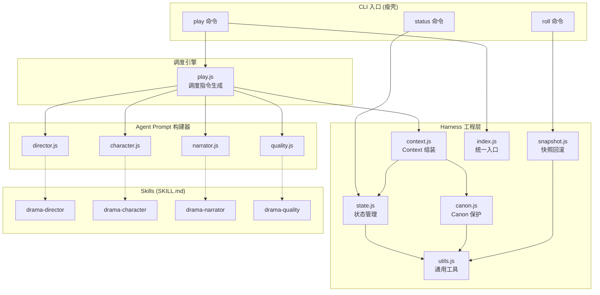

## 产品概述

DramaAgent 是一个面向连载剧情自动生产的工程系统。当前 v1.0 架构以单体 `src/cli.js`（824行）为核心，通过 8 个 CLI 命令手动串联生产流程，通用性和自动化程度不足。需要重构为 **Skill + Harness + Team Agents** 三层架构，实现真正的 Multi-Agent 自动化剧本生产。

## 核心功能

### 1. Harness 工程层模块化

将 cli.js 中耦合的状态管理、Canon 保护、快照回滚、Context 组装等逻辑拆分为独立模块，形成可复用的工程基座。

### 2. Team Agent 调度引擎

`play` 命令从"生成静态 playbook 文件等人手动执行"升级为真正的调度入口，直接生成 team_create / task / send_message / team_delete 指令，支持串行（M4 subagent）和并行（M5 team agent）两种模式。

### 3. 命令精简

从 9 个命令精简为 3 个核心命令：

- `play`：一键完成初始化 → 导演分场 → 角色演绎 → 旁白整合 → 质量验收 → 归档
- `status`：查看系列/单集进度
- `roll`：快照回滚

### 4. Agent Prompt 构建器统一化

4 个 agent（director/character/narrator/quality）采用统一的 `buildPrompt(context)` 接口，从 Harness Context 组装器获取标准化上下文，不再各自读取文件。

### 5. Skills 升级为 Team Agent 兼容

4 个 SKILL.md 升级为包含 Team Agent 通信协议、I/O 文件契约、Harness 集成说明的完整 agent 角色定义。

### 6. 数据层简化

砍掉 v1.0 的 episode-brief/beat-sheet/tasks/spec 四件套模板，这些内容由 Agent 自动生成，单集目录结构精简为 `.dramaspec.json + scene-manifest.json + runtime/ + narrative.md + check-report.md + wrap-report.md`。

## Tech Stack

- 运行时：Node.js >= 18，零外部依赖（保持现有约束）
- 模块系统：ESM（`"type": "module"`）
- Agent 调度：CodeBuddy Skills + Commands 协议 + Team Agent API
- 测试：Node.js 内置 `node:test`
- 数据格式：JSON + Markdown + YAML（保持现有约束）

## Implementation Approach

**策略**：将单体 cli.js 拆分为 Harness 模块化工程层，重写 play.js 为真正的调度引擎，升级 Skills 为 Team Agent 兼容，精简命令和模板。

**关键决策**：

1. **Harness 拆分为 6 个子模块**（utils/state/canon/snapshot/context/index），而非 2-3 个大模块——因为每个模块职责清晰、可独立测试、符合 SRP
2. **保留 src/agents/ 构建器但统一接口**——复用已有 prompt 逻辑，只改入参契约
3. **play.js 生成调度协议而非直接执行**——因为实际 Agent spawn 由 CodeBuddy 运行时完成，CLI 只负责生成指令
4. **向后兼容旧集数据**——ep01/ep02/ep03 的旧目录结构仍可被 status/roll 读取

## Implementation Notes

- **向后兼容**：`state.js` 的 `readEpisodeMeta` 需兼容旧集目录中存在 episode-brief.md 等 v1.0 文件的情况，不主动删除
- **工具函数去重**：play.js 中重复定义的 `readText/writeText/writeJson/loadCharacters` 统一从 `harness/utils.js` 和 `harness/canon.js` 导入
- **测试回归**：现有 5 个测试用例中 `new` 和 `check` 命令的测试需要适配；`play` 命令需新增测试
- **Hooks 零改动**：`harness/hooks/hooks.json` 和 5 个 hook 脚本完全不动，降低爆炸半径
- **快照安全**：`snapshot.js` 中 `resolveWithin` 路径校验必须从 cli.js 完整迁移

## Architecture Design



### 数据流

```
用户: drama-agent play ep04 --title "新集" --logline "..."
  │
  ├─ 1. CLI 路由 → play 命令
  ├─ 2. Harness 初始化
  │     state.init(ep04) → 创建目录 + .dramaspec.json
  │     snapshot.create(ep04) → 保存快照
  │     state.transition(ep04, 'playing')
  ├─ 3. Context 组装
  │     context.build(ep04) → { seriesBible, characters, carryOvers, scenes, meta }
  ├─ 4. 调度引擎生成指令
  │     play.js → 4步调度协议 (director→characters→narrator→quality)
  │     每步: { agent, skill, prompt, inputs, outputs, dependsOn }
  ├─ 5. 产出写入 runtime/
  │     director-notes.md → scenes/S01~S04.md → narrative.md → check-report.md
  └─ 6. 自动归档
        state.transition(ep04, 'wrapped')
        state.extractCarryOvers(ep04) → series-state.json
```

## Directory Structure

```
src/
├── cli.js                          # [MODIFY] 重写为瘦壳路由 ~100行。只做参数解析和命令分发（play/status/roll），
│                                   #   所有业务逻辑委托给 harness 模块和 play.js
├── play.js                         # [MODIFY] 重写为调度引擎。生成可执行的分步调度协议（含完整 prompt、I/O 路径、
│                                   #   依赖关系），支持 serial/team 两种模式，集成 harness context 组装
├── harness/
│   ├── index.js                    # [NEW] Harness 统一入口。re-export 所有子模块，提供 harness.init(episodeId)、
│   │                               #   harness.wrap(episodeId) 等便捷方法
│   ├── utils.js                    # [NEW] 通用工具函数。提取自 cli.js：readText/writeText/readJson/writeJson/
│   │                               #   ensureDir/exists/nowIso/stamp/renderTemplate/parseArgs/resolveWithin
│   ├── state.js                    # [NEW] 状态管理模块。提取自 cli.js：Episode 生命周期管理、路径常量
│   │                               #   （EPISODES_DIR/CHARACTERS_DIR 等）、安全校验（assertEpisodeId/assertSceneId）、
│   │                               #   series-state 读写、episodeMeta CRUD、状态流转（draft→playing→reviewing→wrapped）
│   ├── canon.js                    # [NEW] Canon 保护模块。提取自 cli.js 和 play.js：loadCharacters（YAML 解析）、
│   │                               #   loadSeriesBible、角色卡字段校验，与 pre-tool-use hook 配合保护 canon 文件
│   ├── snapshot.js                 # [NEW] 快照与回滚模块。提取自 cli.js：createSnapshot（带时间戳）、
│   │                               #   listSnapshots、rollbackTo（先安全快照再恢复），含 resolveWithin 路径安全校验
│   └── context.js                  # [NEW] Context 组装器。整合 play.js 中的上下文构建逻辑，
│                                   #   导出 buildAgentContext(episodeId) 返回标准化 context 对象：
│                                   #   { seriesBible, episodeBrief, beatSheet, spec, carryOvers, characters, scenes, features, meta }
├── agents/
│   ├── director.js                 # [MODIFY] 统一接口为 buildPrompt(context)，从 harness/context 获取输入
│   ├── character.js                # [MODIFY] 统一接口为 buildPrompt(context)，增加 directorNotes 运行时注入
│   ├── narrator.js                 # [MODIFY] 统一接口为 buildPrompt(context)，增加 sceneContents 运行时注入
│   └── quality.js                  # [MODIFY] 统一接口为 buildPrompt(context)，增加 narrativeContent 运行时注入

.codebuddy/
├── commands/drama/
│   ├── play.md                     # [MODIFY] 升级为一键全流程调度命令，整合 init→director→characters→narrator→quality→wrap
│   ├── status.md                   # [MODIFY] 适配新 harness 模块路径
│   ├── roll.md                     # [MODIFY] 适配新 harness 模块路径
│   ├── new.md                      # [DELETE] 合并入 play
│   ├── brief.md                    # [DELETE] 导演 Agent 自动分场
│   ├── run.md                      # [DELETE] 合并入 play
│   ├── scene.md                    # [DELETE] 砍掉
│   ├── check.md                    # [DELETE] 内化到质量 Agent
│   └── wrap.md                     # [DELETE] 合并入 play
├── skills/
│   ├── drama-director/SKILL.md     # [MODIFY] 增加 Team Agent I/O 契约、inputs/outputs 文件清单、harness 集成说明
│   ├── drama-character/SKILL.md    # [MODIFY] 增加 Team Agent I/O 契约、运行时依赖（director-notes.md）说明
│   ├── drama-narrator/SKILL.md     # [MODIFY] 增加 Team Agent I/O 契约、运行时依赖（scenes/*.md）说明
│   └── drama-quality/SKILL.md      # [MODIFY] 增加 Team Agent I/O 契约、wrap 触发条件说明

templates/
├── series-bible.md                 # [KEEP]
├── character.yaml                  # [KEEP]
├── three-act-preset.yaml           # [KEEP]
├── episode-brief.md                # [DELETE] Agent 自动生成
├── beat-sheet.md                   # [DELETE] 导演 prompt 内化
├── tasks.md                        # [DELETE] 无手动任务
└── spec.md                         # [DELETE] 质量 Agent prompt 内化

tests/
└── drama-agent.test.js             # [MODIFY] 适配新模块结构，增加 harness 各模块单元测试

docs/PRD.md                         # [MODIFY] 更新为 v3.0 架构说明
AGENTS.md                           # [MODIFY] 更新为新架构说明
CODEBUDDY.md                        # [MODIFY] 更新项目指导
README.md                           # [MODIFY] 更新为 v3.0 文档
package.json                        # [MODIFY] 更新 scripts 命令
```

## Agent Extensions

### Skill

- **drama-director**
- Purpose: 重构后作为 Team Agent 核心成员，负责单集分场和导演指令生成
- Expected outcome: SKILL.md 升级为包含完整 Team Agent 通信协议和 I/O 文件契约的 agent 定义

- **drama-character**
- Purpose: 重构后在 Team 模式中被 spawn 为角色群 agent，基于角色卡演绎场景对话
- Expected outcome: SKILL.md 升级为声明运行时依赖（director-notes.md）的 Team Agent 角色定义

- **drama-narrator**
- Purpose: 重构后作为 Team Agent 成员，将场景演绎文件整合为可发布叙事文本
- Expected outcome: SKILL.md 升级为声明运行时依赖（scenes/*.md）的 Team Agent 角色定义

- **drama-quality**
- Purpose: 重构后作为 Team Agent 最终验收环节，产出 check-report 并决定是否 wrap
- Expected outcome: SKILL.md 升级为包含 PASS/FAIL 触发逻辑和 wrap 条件说明的 agent 定义

### MCP

- **notion**
- Purpose: 将更新后的 PRD v3.0 同步到 Notion 工作空间
- Expected outcome: Notion 页面内容更新为重构后的架构文档