## 产品概述

DramaAgent v3 是一个 **AI Agent 身份模拟平台**——类似"AI 小镇"，核心不是固定流水线的剧本生产工具，而是给 Agent 赋予身份、记忆、人格，让它们在世界观约束下自由交互演绎。Skill 是可插拔的内容输出类型（剧本、小说、互动叙事等），Harness Engineering 保证整个模拟世界的可控性、可靠性、可组合性、持久性和可观测性。

## 核心功能

### 1. Agent 身份系统

每个 Agent 是一个拥有独立身份的"居民"，不是执行脚本的工具。每个 Agent 目录包含：

- **SOUL.yaml** — 我是谁：名字、原型、核心欲望、恐惧、秘密、说话风格、情绪基线
- **MEMORY.md** — 我经历了什么：纯事实、有界容量、按时间戳、跨集持久化
- **RULES.md** — 我的行为边界：不可逾越的红线、身份一致性约束

Agent 之间通过 send_message 自由交互，对话和行为由身份驱动，不受固定步骤约束。

### 2. 世界引擎（World Engine）

维护共享世界状态：世界观（series-bible）、时间线、全局事件、地点状态。每次模拟推进（Episode / Session），世界引擎负责：

- 注入世界上下文给所有 Agent
- 收集 Agent 交互产出
- 更新世界时间线和全局状态
- 管理 carry-over（跨集悬念传递）

### 3. Skill 内容类型库（可插拔）

Skill 定义的不是"角色职能"，而是"内容输出类型"：

- **screenplay** — 剧本格式输出（场景描述 + 对话 + 舞台指示）
- **novel** — 小说格式输出（第三人称叙事 + 内心独白 + 环境描写）
- **interactive** — 互动叙事输出（分支选择 + 后果追踪）

每种 Skill 可以被任意 Agent 组合"装备"，同一次模拟可以产出多种格式。

### 4. Harness 工程层（五大保证）

- **可控性** — Canon 保护、Agent 行为门控、世界规则执行
- **可靠性** — 快照回滚、状态持久化、错误恢复
- **可组合性** — Agent 动态加入/退出、Skill 热插拔、世界可扩展
- **持久性** — Agent 记忆跨 Session 持久化、经验沉淀、世界状态增量更新
- **可观测性** — 全链路事件日志、Agent 交互 trace、运行报告、记忆变更审计

### 5. 模拟命令

- **`sim`** — 启动一次模拟 Session（指定 Episode/场景/参与 Agent/Skill）
- **`status`** — 查看世界状态、Agent 状态、记忆摘要
- **`recall`** — 查询 Agent 记忆、搜索历史交互
- **`roll`** — 快照回滚到任意时间点

## Tech Stack

- 运行时：Node.js >= 18，零外部依赖
- 模块系统：ESM（`"type": "module"`）
- Agent 身份：YAML（SOUL）+ Markdown（MEMORY/RULES）文件体系
- 内容 Skill：CodeBuddy Skill 标准结构（SKILL.md + scripts/ + references/）
- Harness：CodeBuddy Skills + Commands + Hooks 协议
- 记忆存储：文件系统（Markdown + JSON），参考 OpenClaw/Hermes 有界记忆模型
- 测试：Node.js 内置 `node:test`
- 数据格式：YAML + Markdown + JSON

## Implementation Approach

### 核心设计理念

**"给 Agent 身份，让它们自由演绎"** — 参考斯坦福 AI 小镇的 Generative Agents 架构，每个 Agent 的行为由其身份（SOUL）、记忆（MEMORY）和当前世界状态共同驱动，而非固定脚本。

### 关键架构决策

**1. Agent = 目录，不是代码**

每个 Agent 是 `agents/<agent-id>/` 下的一组声明式文件，不是 JS 类。这与 OpenClaw 的五文件体系（SOUL/MEMORY/AGENTS/TOOLS/HEARTBEAT）对齐，也让 Agent 可以被 CodeBuddy 的 Skill/Command 系统直接消费。

```
agents/lin-qi/
  SOUL.yaml      ← 从现有 characters/lin-qi.yaml 扩展
  MEMORY.md      ← 新建，有界记忆（参考 Hermes ~2000 字符上限）
  RULES.md       ← 行为红线
```

**2. Skill = 内容类型，不是角色职能**

v2 的"导演 Skill / 角色 Skill / 旁白 Skill / 质量官 Skill"是固定流水线思维。v3 的 Skill 是可插拔的内容格式——screenplay / novel / interactive。Agent 可以装备任意 Skill 组合。

```
.codebuddy/skills/
  drama-screenplay/SKILL.md   ← 剧本格式输出规范
  drama-novel/SKILL.md         ← 小说格式输出规范
  drama-harness/SKILL.md       ← Harness 工程能力
  drama-world/SKILL.md         ← 世界引擎运行规范
```

**3. 世界引擎 = Harness 的模拟控制层**

参考 Multi-Agent Harness 四层架构（知识供给 / 执行编排 / 风险门控 / 治理运营），世界引擎负责：

- **知识供给**：组装 Agent context（SOUL + MEMORY + 世界状态 + 当前场景）
- **执行编排**：决定哪些 Agent 参与当前场景，管理 send_message 交互
- **风险门控**：Canon 保护、Agent OOC（Out of Character）检测、记忆越界拦截
- **治理运营**：事件日志、记忆变更审计、carry-over 提取

**4. 记忆系统：有界 + 结构化 + 可搜索**

参考 Hermes Agent 的有界记忆设计（MEMORY.md ~2000 字符）和 OpenClaw 的"纯事实"原则：

- 每个 Agent 的 MEMORY.md 有容量上限（约 2000 字符）
- 只记录事实（什么时候发生了什么），不记录规则
- 满载时需要合并/淘汰旧记忆
- 旧记忆归档到 `memory-archive/` 目录（可搜索但不自动加载）

**5. 从固定流水线到自由交互**

v2 是 director -> characters -> narrator -> quality 四步流水线。v3 改为：

- Agent 之间通过 send_message 自由对话
- 世界引擎提供场景上下文和时间推进
- 内容 Skill 在模拟结束后从交互记录中提取/整合输出
- 质量检查内化为 Harness 门控层的持续监控，不是最后一步

### 与现有资产的衔接

| 现有资产 | v3 处置 |
| --- | --- |
| `characters/*.yaml` | 扩展为 `agents/*/SOUL.yaml`，增加 emotion_state / memory_capacity 等字段 |
| `series-bible.md` | 保留，升级为 `world/bible.md`，成为世界引擎的核心输入 |
| `series-state.json` | 保留，升级为 `world/state.json`，增加时间线和全局事件 |
| `episodes/ep01~03/` | 保留为历史数据，narrative.md 等产出不变 |
| `src/` 全部 | 删除，逻辑分散到 Skills 的 scripts/ 中 |
| 4 个 agent SKILL.md | 重新定义为内容 Skill + 世界引擎 Skill + Harness Skill |
| `scripts/hooks/*` | 保留不动 |
| `scripts/validate-character.js` | 迁移到 drama-harness/scripts/validate.js |


## Implementation Notes

- **SOUL.yaml 向后兼容**：SOUL.yaml 是现有 character YAML 的超集，老字段全部保留，新增 `memory_capacity`、`emotion_state`、`interaction_style` 等字段。`scripts/validate-character.js` 需要同步升级校验逻辑。
- **MEMORY.md 容量控制**：参考 Hermes 的 2200 字符上限。memory 工具提供 add/replace/remove 操作。满载时 Agent 必须先合并或淘汰旧条目。淘汰的条目移入 `memory-archive/{episode-id}.md`。
- **世界引擎不直接执行 Agent**：世界引擎生成场景上下文和调度指令，实际 Agent spawn 由 CodeBuddy team_create/task 完成。这保持了与 CodeBuddy 运行时的兼容。
- **Hooks 零改动**：`harness/hooks/hooks.json` 和 5 个 hook 脚本完全不动。新增的可观测性通过 drama-harness Skill 的 scripts/ 实现。
- **Canon 保护升级**：从只保护 `series-bible.md` + `characters/*.yaml` 扩展到保护 `agents/*/SOUL.yaml` + `world/bible.md`。`pre-tool-use.js` 需要更新正则。

## Architecture Design

```mermaid
graph TB
    subgraph WORLD["世界引擎"]
        BIBLE["world/bible.md<br/>世界观"]
        STATE["world/state.json<br/>时间线+全局事件"]
        TIMELINE["world/timeline.md<br/>已发生事件流"]
    end

    subgraph AGENTS["Agent 居民"]
        subgraph LQ["agents/lin-qi/"]
            LQ_SOUL["SOUL.yaml<br/>身份"]
            LQ_MEM["MEMORY.md<br/>记忆"]
            LQ_RULES["RULES.md<br/>红线"]
        end
        subgraph SY["agents/su-yao/"]
            SY_SOUL["SOUL.yaml"]
            SY_MEM["MEMORY.md"]
            SY_RULES["RULES.md"]
        end
        subgraph GM["agents/gao-ming/"]
            GM_SOUL["SOUL.yaml"]
            GM_MEM["MEMORY.md"]
            GM_RULES["RULES.md"]
        end
    end

    subgraph SKILLS["Skill 内容库"]
        SK_SCREEN["drama-screenplay<br/>剧本格式"]
        SK_NOVEL["drama-novel<br/>小说格式"]
        SK_HARNESS["drama-harness<br/>工程能力"]
        SK_WORLD["drama-world<br/>世界引擎"]
    end

    subgraph HARNESS["Harness 五大保证"]
        H_CTRL["可控性<br/>Canon保护+门控"]
        H_RELY["可靠性<br/>快照+回滚"]
        H_COMP["可组合性<br/>Agent动态编排"]
        H_PERSIST["持久性<br/>记忆+状态持久化"]
        H_OBSERVE["可观测性<br/>事件日志+trace"]
    end

    subgraph COMMANDS["Commands"]
        CMD_SIM["drama:sim<br/>启动模拟"]
        CMD_STATUS["drama:status<br/>查看状态"]
        CMD_RECALL["drama:recall<br/>查询记忆"]
        CMD_ROLL["drama:roll<br/>快照回滚"]
    end

    CMD_SIM --> SK_WORLD
    SK_WORLD --> WORLD
    SK_WORLD --> AGENTS
    SK_WORLD --> SKILLS

    LQ_SOUL --> SK_WORLD
    LQ_MEM --> SK_WORLD
    SY_SOUL --> SK_WORLD
    GM_SOUL --> SK_WORLD

    BIBLE --> SK_WORLD
    STATE --> SK_WORLD

    SK_WORLD --> H_CTRL
    SK_WORLD --> H_PERSIST
    SK_WORLD --> H_OBSERVE

    CMD_STATUS --> SK_HARNESS
    CMD_RECALL --> SK_HARNESS
    CMD_ROLL --> SK_HARNESS

    SK_HARNESS --> H_RELY
    SK_HARNESS --> H_OBSERVE
```



### 模拟数据流

```
用户: drama:sim ep04 --title "暗流" --agents lin-qi,su-yao,gao-ming --skill screenplay

  1. Harness 初始化
     drama-harness/scripts/init.js
       创建 episodes/ep04/ 目录
       快照当前世界状态
       状态 -> simulating

  2. 世界引擎组装上下文
     drama-world/scripts/build-context.js
       读取 world/bible.md + world/state.json (世界)
       读取 agents/*/SOUL.yaml + MEMORY.md (每个Agent的身份+记忆)
       读取 carryOvers (跨集悬念)
       输出: 场景上下文 + Agent 调度指令

  3. Agent 自由交互
     team_create("drama-ep04")
       spawn lin-qi (SOUL + MEMORY + 场景上下文)
       spawn su-yao
       spawn gao-ming
       Agent 之间 send_message 自由对话
       世界引擎通过 send_message 推进时间/注入事件

  4. 内容 Skill 整合
     drama-screenplay/scripts/compile.js
       从交互记录提取对话和行动
       按剧本格式编排
       输出 episodes/ep04/output/screenplay.md

  5. Harness 收尾
     drama-harness/scripts/wrap.js
       更新每个 Agent 的 MEMORY.md (有界写入)
       提取 carry-over -> world/state.json
       生成 episodes/ep04/session-report.md (可观测性)
       状态 -> wrapped
```

## Directory Structure

```
dramaspec/                              # [KEEP] 保留为历史数据层
  series-bible.md                       # [MOVE] 迁移到 world/bible.md
  series-state.json                     # [MOVE] 迁移到 world/state.json
  characters/                           # [DEPRECATE] 被 agents/ 取代，保留作兼容
  episodes/ep01~03/                     # [KEEP] 历史产出不变

world/                                  # [NEW] 世界状态目录
  bible.md                              # [NEW] 世界观（从 series-bible.md 升级，增加地点/时间规则）
  state.json                            # [NEW] 世界状态（从 series-state.json 升级，增加时间线/全局事件/Agent关系图）
  timeline.md                           # [NEW] 已发生事件时间线（世界引擎自动维护，跨集累积）

agents/                                 # [NEW] Agent 居民目录
  lin-qi/
    SOUL.yaml                           # [NEW] 身份文件。从 characters/lin-qi.yaml 扩展：
                                        #   保留全部原有字段(id/name/archetype/desire/fear/secret/voice/status/
                                        #   emotion_default/relationships/notes)
                                        #   新增: memory_capacity(记忆容量上限), interaction_style(交互偏好),
                                        #   emotion_state(当前情绪，可变), known_facts(已知事实索引)
    MEMORY.md                           # [NEW] 有界记忆文件。参考 Hermes/OpenClaw 设计：
                                        #   容量上限 ~2000 字符，只记纯事实+时间戳
                                        #   分区: 关键事件 / 关系变化 / 未解之谜
                                        #   满载时合并旧条目，淘汰项归档到 memory-archive/
    RULES.md                            # [NEW] Agent 行为红线：
                                        #   不可主动揭示 secret 除非被逼到绝境
                                        #   不可跳出角色用第三人称说话
                                        #   不可凭空获知其他 Agent 的 secret
    memory-archive/                     # [NEW] 记忆归档目录，按 episode 分文件
      ep01.md                           # [NEW] ep01 期间的淘汰记忆
  su-yao/                               # [NEW] 同上结构
    SOUL.yaml
    MEMORY.md
    RULES.md
    memory-archive/
  gao-ming/                             # [NEW] 同上结构
    SOUL.yaml
    MEMORY.md
    RULES.md
    memory-archive/

.codebuddy/skills/
  drama-harness/                        # [NEW] Harness 工程层 Skill
    SKILL.md                            # [NEW] Harness 规范：五大保证的定义、与其他 Skill 的集成方式、
                                        #   Canon 保护范围（world/bible.md + agents/*/SOUL.yaml）、
                                        #   scripts/ 各脚本用途和 CLI 映射
    scripts/
      lib.js                            # [NEW] 共享工具库。从 cli.js 提取：路径常量工厂 getPaths()、
                                        #   readText/writeText/readJson/writeJson/ensureDir/exists/resolveWithin/
                                        #   nowIso/stamp/parseArgs。所有 Skill 脚本共享此库
      init.js                           # [NEW] 模拟初始化。创建 episode 目录、快照世界状态、
                                        #   创建 session 运行时目录、设状态为 simulating
      wrap.js                           # [NEW] 模拟收尾。更新 Agent MEMORY.md（有界写入）、
                                        #   提取 carry-over 到 world/state.json、生成 session-report.md
      snapshot.js                       # [NEW] 快照/回滚。从 cli.js 迁移 snapshotEpisode/listSnapshots/
                                        #   rollbackTo 三个函数，扩展到支持世界状态快照
      status.js                         # [NEW] 状态查询。世界状态+Agent 状态+记忆摘要
      validate.js                       # [NEW] 校验。Agent SOUL.yaml 字段校验（扩展原 validate-character.js）、
                                        #   MEMORY.md 容量检查、RULES.md 格式检查
      memory.js                         # [NEW] 记忆工具。add/replace/remove 操作、容量检查、
                                        #   满载时归档到 memory-archive/、记忆搜索

  drama-world/                          # [NEW] 世界引擎 Skill
    SKILL.md                            # [NEW] 世界引擎规范：世界状态管理、时间线维护、
                                        #   场景上下文组装、Agent 调度协议、carry-over 管理
    scripts/
      build-context.js                  # [NEW] 上下文组装器。读取 world/ + agents/*/SOUL.yaml +
                                        #   agents/*/MEMORY.md，构建每个 Agent 的完整 prompt context
      update-world.js                   # [NEW] 世界状态更新。从模拟产出中提取事件更新 world/state.json
                                        #   和 world/timeline.md
      build-scene.js                    # [NEW] 场景构建器。根据世界状态和 carry-over 生成场景提示
    references/
      interaction-protocol.md           # [NEW] Agent 间交互协议文档：send_message 消息类型、
                                        #   世界引擎介入时机、时间推进规则、OOC 检测标准

  drama-screenplay/                     # [REPLACE drama-narrator + drama-director + drama-character + drama-quality]
    SKILL.md                            # [NEW] 剧本格式 Skill：从 Agent 交互记录中提取对话和行动，
                                        #   编排为标准剧本格式（场景标题 + 舞台指示 + 角色对话 + 导演注释）
    scripts/
      compile.js                        # [NEW] 编译器。读取 runtime/ 下的交互记录，
                                        #   按剧本格式整合输出到 output/screenplay.md
    references/
      format-guide.md                   # [NEW] 剧本格式规范

  drama-novel/                          # [NEW] 小说格式 Skill
    SKILL.md                            # [NEW] 小说格式 Skill：从 Agent 交互记录中提取并改写为
                                        #   第三人称叙事文本（内心独白 + 环境描写 + 对话）
    scripts/
      compile.js                        # [NEW] 编译器。读取交互记录，整合为小说格式 output/novel.md
    references/
      format-guide.md                   # [NEW] 小说叙事规范

  drama-director/                       # [MODIFY] 从"流水线导演"重新定义为"世界管理者视角"
    SKILL.md                            # [MODIFY] 重写为：世界管理者视角 Skill，负责在模拟中
                                        #   通过 send_message 对 Agent 施加压力、推进时间、注入事件、
                                        #   判断场景是否达成目标。不再是固定流水线的第一步
  drama-character/                      # [DELETE] 角色能力内化到 Agent 身份系统
  drama-quality/                        # [DELETE] 质量检查内化到 Harness 门控层

.codebuddy/commands/drama/
  sim.md                                # [NEW] 模拟命令。替代原 play：指定 episode/agents/skill，
                                        #   调用 drama-harness init -> drama-world build-context ->
                                        #   team agent 自由交互 -> content skill compile -> harness wrap
  status.md                             # [MODIFY] 适配新路径，展示世界状态 + Agent 记忆摘要
  recall.md                             # [NEW] 记忆查询命令。查询指定 Agent 的记忆、搜索历史交互
  roll.md                               # [MODIFY] 适配新路径，支持世界状态回滚
  play.md                               # [DELETE] 被 sim 取代
  new.md                                # [DELETE] 合并入 sim
  brief.md                              # [DELETE]
  run.md                                # [DELETE]
  scene.md                              # [DELETE]
  check.md                              # [DELETE]
  wrap.md                               # [DELETE]

bin/
  drama-agent.js                        # [MODIFY] 重写为极简路由壳，路由到 harness/world skill 脚本

src/                                    # [DELETE] 整个目录删除
templates/
  series-bible.md                       # [KEEP] 新世界初始化模板
  character.yaml                        # [DEPRECATE] 被 SOUL.yaml 模板取代
  soul.yaml                             # [NEW] Agent SOUL.yaml 模板
  memory.md                             # [NEW] Agent MEMORY.md 初始模板
  rules.md                              # [NEW] Agent RULES.md 初始模板
  episode-brief.md                      # [DELETE]
  beat-sheet.md                         # [DELETE]
  tasks.md                              # [DELETE]
  spec.md                               # [DELETE]
  three-act-preset.yaml                 # [MOVE] 移入 drama-screenplay/references/

tests/
  drama-agent.test.js                   # [MODIFY] 适配新架构，测试 Agent 身份加载/记忆读写/世界状态更新

docs/PRD.md                             # [MODIFY] 重写为 v3.0 AI Agent 身份模拟平台 PRD
AGENTS.md                               # [MODIFY] 重写为 v3.0 架构说明
CODEBUDDY.md                            # [MODIFY] 更新项目指导
README.md                               # [MODIFY] 重写为 v3.0 文档
package.json                            # [MODIFY] 更新 scripts
```

## Key Code Structures

```
# agents/lin-qi/SOUL.yaml — Agent 身份文件结构
# 从现有 character YAML 超集扩展

id: lin-qi
name: 林七
archetype: 舞台监督 / 不可靠见证者

# --- 核心驱动力（保留原字段） ---
desire: 保护剧场不被关闭，同时查清旧火灾的真相
fear: 自己当年的沉默会被认定为共犯
secret: 她偷偷保存了一卷从火场带出的旧排练录像
voice: 冷静、短句、习惯先观察再开口

# --- 状态（保留原字段，增加可变状态） ---
status: active
emotion_default: guarded
emotion_state: guarded  # 可变，每次模拟后更新

# --- 关系（保留原字段） ---
relationships:
  - target: su-yao
    type: 旧搭档 / 互相试探
    trust: 0.3            # 新增：信任度量化
    summary: 她信不过苏遥突然回归的真正目的

# --- v3 新增字段 ---
memory_capacity: 2000     # MEMORY.md 字符上限
interaction_style: observer-first  # 交互偏好：先观察再行动
known_facts: []           # 当前已知事实索引（由世界引擎维护）

notes:
  surface: 办事利落、对时间和秩序极度敏感
  fracture: 一旦涉及火灾旧案会立刻情绪封闭
  season_arc: 从守住残局转向主动揭案
```

```markdown
<!-- agents/lin-qi/MEMORY.md — Agent 记忆文件结构 -->
<!-- 参考 OpenClaw: 只记纯事实，不记规则 -->
<!-- 参考 Hermes: 有界容量 ~2000 字符 -->

# MEMORY.md - 林七的记忆

## 关键事件
- **EP01** 剧场重新开放，苏遥突然回归，我没有当面质问她为什么消失了五年
- **EP02** 高鸣向我提出用监控碎片换录像带，我拒绝了但他知道我有那盘录像
- **EP03** 投影系统被入侵，播放了周柏清五年前交接文件箱的监控画面，苏遥的反应说明她认识画面中的人

## 关系变化
- **EP02** 高鸣知道了我有录像带这件事，我们之间从"试探"变成了"各怀筹码"
- **EP03** 苏遥在看到监控画面时的手部动作和画面中背影一致——她可能就是那个接箱子的人

## 未解之谜
- 谁入侵了投影系统？对方能接入剧场内部对讲系统
- 高鸣收到匿名委托人新消息后中途离场，他做了什么决定？
```

## Agent Extensions

### Skill

- **drama-director**
- Purpose: 从"固定流水线导演"重新定义为"世界管理者视角"Skill，在模拟中通过 send_message 对 Agent 施加叙事压力、推进时间、注入外部事件
- Expected outcome: SKILL.md 重写为世界管理者规范，描述如何在自由交互中保持叙事张力而不限制 Agent 自主性

- **drama-character**
- Purpose: 角色演绎能力将内化到 Agent 身份系统（SOUL.yaml + MEMORY.md + RULES.md），此 Skill 标记为废弃
- Expected outcome: 角色行为规范迁移到每个 Agent 的 RULES.md 中

- **drama-narrator**
- Purpose: 旁白整合能力将重构为内容格式 Skill（drama-screenplay / drama-novel），不再是固定流水线步骤
- Expected outcome: 叙事整合规范拆分到 drama-screenplay 和 drama-novel 两个新 Skill 中

- **drama-quality**
- Purpose: 质量验收能力将内化到 Harness 门控层（drama-harness Skill 的 validate.js），不再是独立 Skill
- Expected outcome: 验收维度迁移到 drama-harness/SKILL.md 和 validate.js 中

- **skill-creator**
- Purpose: 在实现过程中用于创建新的 Skill（drama-harness / drama-world / drama-screenplay / drama-novel）
- Expected outcome: 按标准 Skill 结构生成 SKILL.md + scripts/ + references/

### MCP

- **notion**
- Purpose: 将重写后的 PRD v3.0 同步到 Notion 工作空间
- Expected outcome: Notion 页面更新为 AI Agent 身份模拟平台的完整 PRD