## 产品概述

DramaAgent 是一个面向连载剧情自动生产的工程系统。当前架构以单体 `src/cli.js`（824行）为核心，通用性不足。需要重构为纯 **Skill 体系**：砍掉 `src/` 目录，所有逻辑回归到 5 个 Skills 中，以 Skill 标准结构（SKILL.md + scripts/ + references/）组织全部能力。

## 核心功能

### 1. drama-harness Skill（工程层）

一个 Skill 封装全部 Harness 工程能力：Episode 初始化、归档、快照回滚、Context 组装、状态查询、Canon 校验。scripts/ 下放置 6 个可执行脚本，替代原 cli.js 中 800+ 行逻辑。

### 2. drama-director Skill（导演 + 调度）

导演即调度者。SKILL.md 包含分场指令和 Team Agent 编排协议，scripts/ 下放置 prompt 构建器和 playbook 生成器，references/ 下放置调度协议文档和节拍预设。

### 3. drama-character / drama-narrator / drama-quality Skills

三个角色 Skill 各自升级为标准 Skill 结构，scripts/ 下放置 prompt 构建器，SKILL.md 包含 Team Agent I/O 契约和通信协议。

### 4. 命令精简

从 9 个命令精简为 3 个核心命令（play / status / roll），play 成为调用 drama-director Skill 进行 Team Agent 全流程编排的入口。

### 5. 数据层简化

砍掉 v1.0 的 episode-brief / beat-sheet / tasks / spec 四件套模板，这些内容由 Agent 自动生成。

## Tech Stack

- 运行时：Node.js >= 18，零外部依赖（保持现有约束）
- 模块系统：ESM（`"type": "module"`）
- 能力组织：CodeBuddy Skill 标准结构（SKILL.md + scripts/ + references/）
- 命令入口：CodeBuddy Commands（.codebuddy/commands/drama/*.md）
- 生命周期钩子：harness/hooks/hooks.json + scripts/hooks/（保持不动）
- 测试：Node.js 内置 `node:test`
- 数据格式：JSON + Markdown + YAML

## Implementation Approach

**策略**：砍掉 `src/` 目录，将全部逻辑迁移到 5 个 Skill 的 scripts/ 中。每个 Skill 遵循标准结构（SKILL.md + scripts/ + references/），脚本之间通过共享工具库 `drama-harness/scripts/lib.js` 复用通用函数。

**关键决策**：

1. **共享工具库放在 drama-harness/scripts/lib.js**——所有 Skill 脚本通过相对路径 import 此库，解决跨 Skill 代码复用问题。包含：路径常量、readText/writeText/readJson/writeJson、ensureDir/exists/resolveWithin/nowIso/stamp、parseArgs。这比每个 Skill 重复定义工具函数更 DRY，也比创建独立 npm 包更 KISS。

2. **导演 = 调度者**——drama-director 的 SKILL.md 同时定义分场规范和 Team Agent 编排协议（4步流水线），scripts/build-playbook.js 生成可执行的 playbook.json，由 play.md 命令读取后按步调度。

3. **bin/drama-agent.js 保留为极简 CLI 壳**——仅做参数路由，import 并调用 drama-harness/scripts/ 中对应脚本的导出函数。这样 `npm run drama` 仍然可用，保持向后兼容。

4. **context.js 统一 context 对象**——所有 agent prompt 构建器消费同一个 `{ meta, seriesBible, carryOvers, characters, scenes }` 结构体，不再各自读文件。v2.0 简化后不再读取 episode-brief/beat-sheet/spec（已砍掉），只读 series-bible + characters + series-state + scene-manifest + feature_list。

5. **向后兼容旧集数据**——status.js 和 snapshot.js 兼容 ep01/ep02/ep03 旧目录中的 v1.0 文件，不主动删除。

## Implementation Notes

- **lib.js 路径解析**：所有 scripts/ 通过 `import { ... } from '../../drama-harness/scripts/lib.js'` 引用共享库。路径稳定因为 Skills 目录结构固定在 `.codebuddy/skills/` 下。
- **resolveWithin 安全校验必须完整迁移**：从 cli.js L90-100 精确复制，这是防路径遍历攻击的核心机制。
- **Hooks 零改动**：`harness/hooks/hooks.json` 和 5 个 hook 脚本完全不动。hooks 中的路径引用（`scripts/hooks/`）不受影响。
- **测试需要适配**：现有 5 个测试通过 `bin/drama-agent.js` CLI 入口测试，bin 入口改为调用 harness 脚本后测试仍可通过，但需要补充 `play` 命令测试，移除对 `brief` 命令的依赖。
- **模板清理**：删除 4 个模板（episode-brief.md/beat-sheet.md/tasks.md/spec.md），保留 3 个（series-bible.md/character.yaml/three-act-preset.yaml）。three-act-preset.yaml 移入 drama-director/references/ 作为节拍参考。
- **状态机简化**：v2.0 状态流转从 `draft→briefed→running→wrapped` 简化为 `draft→playing→reviewing→wrapped`，与 PRD 一致。

## Architecture Design

```mermaid
graph TB
    subgraph COMMANDS["Commands 命令层"]
        CMD_PLAY["drama:play<br/>一键全流程"]
        CMD_STATUS["drama:status<br/>查看进度"]
        CMD_ROLL["drama:roll<br/>快照回滚"]
    end

    subgraph SKILLS["Skills 能力层"]
        subgraph HARNESS["drama-harness"]
            H_SKILL["SKILL.md"]
            H_INIT["scripts/init.js"]
            H_WRAP["scripts/wrap.js"]
            H_SNAP["scripts/snapshot.js"]
            H_CTX["scripts/context.js"]
            H_STATUS["scripts/status.js"]
            H_VALID["scripts/validate.js"]
            H_LIB["scripts/lib.js"]
        end

        subgraph DIRECTOR["drama-director"]
            D_SKILL["SKILL.md<br/>分场 + 编排协议"]
            D_PROMPT["scripts/build-prompt.js"]
            D_PLAY["scripts/build-playbook.js"]
            D_REF["references/orchestration.md"]
        end

        subgraph CHARACTER["drama-character"]
            C_SKILL["SKILL.md"]
            C_PROMPT["scripts/build-prompt.js"]
        end

        subgraph NARRATOR["drama-narrator"]
            N_SKILL["SKILL.md"]
            N_PROMPT["scripts/build-prompt.js"]
        end

        subgraph QUALITY["drama-quality"]
            Q_SKILL["SKILL.md"]
            Q_PROMPT["scripts/build-prompt.js"]
        end
    end

    subgraph DATA["DramaSpec 数据层"]
        BIBLE["series-bible.md"]
        CHARS["characters/*.yaml"]
        STATE["series-state.json"]
        EPISODES["episodes/ep-xxx/"]
    end

    CMD_PLAY --> D_PLAY
    CMD_PLAY --> H_INIT
    CMD_PLAY --> H_WRAP
    CMD_STATUS --> H_STATUS
    CMD_ROLL --> H_SNAP

    D_PLAY --> H_CTX
    D_PLAY --> D_PROMPT
    D_PLAY --> C_PROMPT
    D_PLAY --> N_PROMPT
    D_PLAY --> Q_PROMPT

    H_CTX --> BIBLE
    H_CTX --> CHARS
    H_CTX --> STATE
    H_CTX --> EPISODES

    H_INIT --> H_LIB
    H_WRAP --> H_LIB
    H_SNAP --> H_LIB
    H_CTX --> H_LIB
    D_PROMPT --> H_LIB
    C_PROMPT --> H_LIB
    N_PROMPT --> H_LIB
    Q_PROMPT --> H_LIB
```



### 数据流

```
用户: drama-agent play ep04 --title "新集" --logline "..."
  |
  +-- 1. bin/drama-agent.js 路由 --> drama-harness/scripts/init.js
  |     创建 episode 目录 + .dramaspec.json + scene-manifest.json + feature_list.json
  |     snapshot.create(ep04)
  |     状态 --> playing
  |
  +-- 2. drama-harness/scripts/context.js
  |     组装 { meta, seriesBible, characters, carryOvers, scenes, features }
  |
  +-- 3. drama-director/scripts/build-playbook.js
  |     生成 runtime/playbook.json (4步调度协议)
  |     每步: { agent, skill, prompt, inputs, outputs, dependsOn }
  |
  +-- 4. 调度执行 (串行 subagent / 并行 team agent)
  |     Step 1: director --> runtime/director-notes.md
  |     Step 2: characters --> runtime/scenes/S01~S04.md
  |     Step 3: narrator --> narrative.md
  |     Step 4: quality --> check-report.md
  |
  +-- 5. drama-harness/scripts/wrap.js
        PASS --> 提取 carry-over --> 更新 series-state.json
        状态 --> wrapped
```

## Directory Structure

```
.codebuddy/skills/
  drama-harness/                        # [NEW] 工程层 Skill
    SKILL.md                            # [NEW] Harness 工程规范：定义 Harness 的职责边界（状态管理/Canon保护/
                                        #   快照回滚/Context组装），声明 scripts/ 下各脚本的用途和 CLI 映射关系，
                                        #   说明与其他 agent skill 的集成方式
    scripts/
      lib.js                            # [NEW] 共享工具库。从 cli.js L16-100 迁移全部工具函数：
                                        #   nowIso/stamp/ensureDir/exists/readText/writeText/readJson/writeJson/
                                        #   resolveWithin/parseArgs。加上路径常量工厂 getPaths(workspaceRoot)
                                        #   返回 { dramaspecDir, episodesDir, charactersDir, snapshotRoot, seriesStateFile }
      init.js                           # [NEW] Episode 初始化。合并 cli.js commandNew(L426-459) + commandBrief(L461-477) +
                                        #   buildDefaultSceneManifest(L197-237) + buildDefaultFeatureList(L239-260) +
                                        #   createEpisodeArtifacts(L262-298)。导出 initEpisode(episodeId, options) 函数
      wrap.js                           # [NEW] 归档 + carry-over。迁移 cli.js commandWrap(L610-651) +
                                        #   upsertWrappedEpisode(L599-608)。导出 wrapEpisode(episodeId) 函数
      snapshot.js                       # [NEW] 快照创建/列出/回滚。迁移 cli.js snapshotEpisode(L300-311) +
                                        #   listSnapshots(L653-664) + commandRoll(L666-698)。
                                        #   导出 createSnapshot/listSnapshots/rollbackTo 三个函数
      context.js                        # [NEW] Context 组装器。整合 play.js L78-113 的 context 构建逻辑 +
                                        #   cli.js loadCharacters(L700-718)。
                                        #   导出 buildContext(episodeId) 返回标准化 context 对象
      status.js                         # [NEW] 状态查询。迁移 cli.js commandStatus(L479-514) +
                                        #   listEpisodes(L313-319)。导出 showStatus(episodeId?) 函数
      validate.js                       # [NEW] 校验 + 检查。迁移 cli.js checkEpisode(L321-407) +
                                        #   renderCheckReport(L409-419) + countMarkdownTasks(L157-161) +
                                        #   containsPlaceholderText(L163-165)。导出 checkEpisode/renderCheckReport 函数

  drama-director/                       # [MODIFY] 导演 + 调度 Skill
    SKILL.md                            # [MODIFY] 重写：增加 Team Agent 编排协议（4步流水线定义、team_create/
                                        #   task/send_message/team_delete 指令模板）、I/O 文件契约、
                                        #   串行(M4)/并行(M5)两种模式说明、与 drama-harness 集成方式
    scripts/
      build-prompt.js                   # [NEW] 导演 prompt 构建器。从 src/agents/director.js 迁移
                                        #   buildDirectorPrompt(context, meta) 函数
      build-playbook.js                 # [NEW] Playbook 生成器。从 src/play.js L78-349 迁移
                                        #   generatePlaybook + buildStepPrompt + renderPlaybookSummary。
                                        #   调用 drama-harness context.js 获取 context，调用各 skill 的
                                        #   build-prompt.js 生成每步 prompt
    references/
      orchestration.md                  # [NEW] Team Agent 调度协议文档。描述 4步流水线的编排规则、
                                        #   send_message 消息类型定义、FAIL 重演回路、team 生命周期管理
      three-act-preset.yaml             # [MOVE] 从 templates/three-act-preset.yaml 移入，作为节拍参考

  drama-character/                      # [MODIFY] 角色群 Skill
    SKILL.md                            # [MODIFY] 增加 Team Agent I/O 契约（inputs: director-notes.md +
                                        #   characters/*.yaml, outputs: runtime/scenes/S01~S04.md）、
                                        #   运行时依赖说明、脚本调用方式
    scripts/
      build-prompt.js                   # [NEW] 角色 prompt 构建器。从 src/agents/character.js 迁移
                                        #   buildCharacterPrompt(context, meta, directorNotesContent)

  drama-narrator/                       # [MODIFY] 旁白 Skill
    SKILL.md                            # [MODIFY] 增加 Team Agent I/O 契约（inputs: runtime/scenes/*.md,
                                        #   outputs: narrative.md）、运行时依赖说明
    scripts/
      build-prompt.js                   # [NEW] 旁白 prompt 构建器。从 src/agents/narrator.js 迁移
                                        #   buildNarratorPrompt(context, meta, sceneContents)

  drama-quality/                        # [MODIFY] 质量官 Skill
    SKILL.md                            # [MODIFY] 增加 Team Agent I/O 契约（inputs: narrative.md +
                                        #   characters/*.yaml + series-state.json, outputs: check-report.md）、
                                        #   PASS/FAIL 触发逻辑、wrap 条件说明
    scripts/
      build-prompt.js                   # [NEW] 质量 prompt 构建器。从 src/agents/quality.js 迁移
                                        #   buildQualityPrompt(context, meta, narrativeContent)

.codebuddy/commands/drama/
  play.md                               # [MODIFY] 重写为一键全流程调度命令：调用 drama-harness init →
                                        #   drama-director build-playbook → 按步调度 4 个 agent skill →
                                        #   drama-harness wrap。支持 --mode serial/team 和 --step 单步模式
  status.md                             # [MODIFY] 适配新路径，调用 drama-harness/scripts/status.js
  roll.md                               # [MODIFY] 适配新路径，调用 drama-harness/scripts/snapshot.js
  new.md                                # [DELETE] 合并入 play
  brief.md                              # [DELETE] 导演 Agent 自动分场
  run.md                                # [DELETE] 合并入 play
  scene.md                              # [DELETE] 砍掉
  check.md                              # [DELETE] 内化到质量 Agent
  wrap.md                               # [DELETE] 合并入 play

bin/
  drama-agent.js                        # [MODIFY] 重写为极简 CLI 壳 (~20行)。import drama-harness/scripts/
                                        #   下的脚本，根据 argv[0] 路由到 play/status/roll 对应函数

src/                                    # [DELETE] 整个目录删除
  cli.js                                # [DELETE] 逻辑已迁移到 drama-harness/scripts/
  play.js                               # [DELETE] 逻辑已迁移到 drama-director/scripts/build-playbook.js
  agents/director.js                    # [DELETE] 迁移到 drama-director/scripts/build-prompt.js
  agents/character.js                   # [DELETE] 迁移到 drama-character/scripts/build-prompt.js
  agents/narrator.js                    # [DELETE] 迁移到 drama-narrator/scripts/build-prompt.js
  agents/quality.js                     # [DELETE] 迁移到 drama-quality/scripts/build-prompt.js

templates/
  series-bible.md                       # [KEEP]
  character.yaml                        # [KEEP]
  three-act-preset.yaml                 # [MOVE] 移到 drama-director/references/
  episode-brief.md                      # [DELETE] Agent 自动生成
  beat-sheet.md                         # [DELETE] 导演 prompt 内化
  tasks.md                              # [DELETE] 无手动任务
  spec.md                               # [DELETE] 质量 Agent prompt 内化

tests/
  drama-agent.test.js                   # [MODIFY] 适配新 CLI 路由，移除对 brief 命令依赖，
                                        #   新增 play 命令的 playbook 生成测试

docs/PRD.md                             # [MODIFY] 更新为 v3.0 Skill 体系架构
AGENTS.md                               # [MODIFY] 更新 5 个 Skill 说明
CODEBUDDY.md                            # [MODIFY] 更新项目指导：Skill 结构 + 3 命令
README.md                               # [MODIFY] 更新为 v3.0 文档
package.json                            # [MODIFY] 更新 scripts 入口
```

## Key Code Structures

```typescript
// drama-harness/scripts/lib.js 核心接口

/** 路径常量工厂——所有 Skill 脚本通过此获取标准路径 */
export function getPaths(workspaceRoot = process.cwd()) {
  // returns { dramaspecDir, episodesDir, charactersDir, snapshotRoot, seriesStateFile, packageRoot }
}

/** 安全路径解析——从 cli.js resolveWithin 精确迁移 */
export function resolveWithin(root: string, ...parts: string[]): string;

// drama-harness/scripts/context.js 核心接口

/** 标准化 Context 对象——所有 agent prompt 构建器消费此结构 */
export interface AgentContext {
  meta: EpisodeMeta;
  seriesBible: string;
  carryOvers: CarryOver[];
  characters: Character[];
  scenes: Scene[];
  features: Feature[];
}

export function buildContext(episodeId: string): AgentContext;

// 各 Skill scripts/build-prompt.js 统一签名
// director:  buildPrompt(context: AgentContext) => string
// character: buildPrompt(context: AgentContext, directorNotes: string) => string
// narrator:  buildPrompt(context: AgentContext, sceneContents: SceneContent[]) => string
// quality:   buildPrompt(context: AgentContext, narrativeContent: string) => string
```

## Agent Extensions

### Skill

- **drama-director**
- Purpose: 重构为导演 + 调度双职责 Skill，SKILL.md 增加 Team Agent 编排协议，scripts/ 增加 build-prompt.js 和 build-playbook.js
- Expected outcome: SKILL.md 包含完整的 4 步流水线定义和 team agent 通信协议，scripts/ 包含从 src/ 迁移并升级的 prompt 构建器和 playbook 生成器

- **drama-character**
- Purpose: 升级为标准 Skill 结构，增加 scripts/build-prompt.js 和 Team Agent I/O 契约
- Expected outcome: SKILL.md 声明 inputs（director-notes.md）/outputs（scenes/*.md）文件契约，scripts/ 包含迁移自 src/agents/character.js 的 prompt 构建器

- **drama-narrator**
- Purpose: 升级为标准 Skill 结构，增加 scripts/build-prompt.js 和 Team Agent I/O 契约
- Expected outcome: SKILL.md 声明 inputs（scenes/*.md）/outputs（narrative.md）文件契约，scripts/ 包含迁移自 src/agents/narrator.js 的 prompt 构建器

- **drama-quality**
- Purpose: 升级为标准 Skill 结构，增加 scripts/build-prompt.js 和 PASS/FAIL 触发逻辑
- Expected outcome: SKILL.md 声明完整验收维度和 wrap 条件，scripts/ 包含迁移自 src/agents/quality.js 的 prompt 构建器