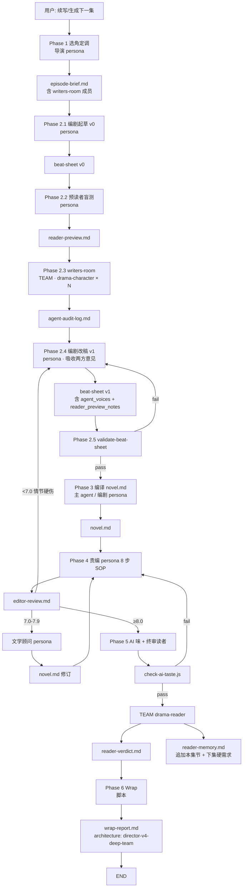

# Workflow · 6 阶段创作流水线（v4 · 单点深度 Team 架构）

> 基于"单点深度 Team + 全程 persona"的剧集生成流水线。
>
> **v4 关键转变**（EP06+ 生效）：把创作对抗集中到 Phase 2（编剧 + 角色 writers-room + 预读者），Phase 3-4 全 persona 直写。废止 Phase 3 心脏戏 team 与 Phase 4 责编 team · Phase 5 终审读者 team 保留。
>
> 设计哲学：**对抗前置、执行收敛**——创作对抗在 Phase 2 内部完成（最便宜、最影响全局），执行阶段相信 Phase 2 产物，persona 高效编译。

---

## v4 Team 模式使用矩阵

| Phase | 子步骤 | 执行者 | 模式 |
|---|---|---|---|
| Phase 1 | 选角定调 | 导演 | 主 agent persona |
| Phase 2.1 | 编剧起草骨架 v0 | drama-writer（persona）| persona |
| Phase 2.2 | 预读者盲测骨架 | drama-reader 的加载模式（persona）| persona |
| Phase 2.3 | **角色 writers-room 审骨架** | drama-character × N | **TEAM 必须** |
| Phase 2.4 | 编剧改稿 → v1 | drama-writer（persona）| persona |
| Phase 2.5 | 机械校验 | validate-beat-sheet.js | 脚本 |
| Phase 3 | 编译 novel.md | 主 agent / 编剧 | persona |
| Phase 4 | 责编 8 步 SOP | drama-editor | persona（v4 降级）|
| Phase 4 | 文学顾问按 order 修订 | drama-advisor(prose) | persona |
| Phase 5 | AI 味硬门控 | check-ai-taste.js | 脚本 |
| Phase 5 | 终审读者盲评 | drama-reader | **TEAM 必须** |
| Phase 6 | Wrap | drama-world scripts | 脚本 |

### 反 persona 三条标准（v4 收敛诠释）

**命中 3/3 → 必须 Team 化**（v4 只有两处满足）：

1. **身份独立性**：TA 的判断需要与作者视角分离吗？
2. **信息封闭性**：TA 应该看不到某些内部文档吗？
3. **对抗性**：TA 的作用是挑毛病吗？

满足两处：
- **Phase 2.3 角色审骨架**（`drama-character` × N）· 3/3 命中
- **Phase 5 终审读者**（`drama-reader`）· 3/3 命中

其他位置命中 ≤1 · persona 足够。

---

## 流水线总览（v4）

```
Phase 1: 导演独立选角定调                              [persona]
Phase 2: 创作班子开盘（内部 5 步）
  ├── 2.1 编剧起草 v0                                [persona]
  ├── 2.2 预读者盲测骨架                              [persona]
  ├── 2.3 角色 writers-room 审骨架                    [TEAM 必须]
  ├── 2.4 编剧改稿 → v1（吸收预读者 + 角色意见）       [persona]
  └── 2.5 validate-beat-sheet 机械校验               [脚本]
Phase 3: 演绎编译 novel.md                           [persona]
Phase 4: 责编内审 + 文学顾问润色                      [persona · persona]
Phase 5: AI 味机械门控 + 终审读者                     [脚本 + TEAM]
Phase 6: Wrap 收尾                                  [脚本]
```

### 与 v3 / v2 对比

| 项 | v2 | v3 | **v4** | 变化 |
|---|---|---|---|---|
| Phase 数 | 6 | 6 | 6（Phase 2 内部 5 步）| = |
| Team 位 | 0（全 persona）| 3（心脏戏 + 责编 + 读者）| **2**（角色审骨架 + 终审读者）| -1 |
| 对抗位置 | Phase 4-5 集中 | Phase 3-5 分散 | **Phase 2 集中** | 前置化 |
| 创作 Agent 数 | 6 | 6 | 6 | = |
| Token/集 | ~33K | ~41K | ~40K | 接近 v3 |
| 预读者反哺 | 无 | 无 | **Phase 2.2 读 reader-memory** | 新增闭环 |
| 角色参与剧情规划 | 无 | 无（角色只执行）| **Phase 2.3 直接参与** | 新增 |

---

## 执行前检查

Director 加载时先检测断点：

```
1. 查找当前故事的 episodes/*/.fsm-state.json
2. 如有未完成 episode（state ≠ idle/wrapped）→ 询问用户是否继续
3. 继续 → 从断点 Phase（含 sub_phase）恢复
4. 不继续 → 正常响应新请求
```

断点恢复时按当前 Phase 重新加载：
- `episode-brief.md`（Phase 1 产出）
- `beat-sheet.md`（Phase 2 产出 · 若在 Phase 2.3+ 则已包含 v0 或 v1）
- `runtime/reader-preview.md`（Phase 2.2 产出 · 若在 Phase 2.3+ 存在）
- `runtime/agent-audit-log.md`（Phase 2.3 产出 · 若在 Phase 2.4+ 存在）
- 任何已有的 `output/*.md`

---

## Phase 1: 导演独立选角定调

| 属性 | 值 |
|---|---|
| **类型** | 确定性（导演独立完成，不 spawn 其他 Agent） |
| **FSM 状态** | idle → initializing → context-ready |
| **Token 预算** | ~3K |

### 目的

导演是**指挥位**——只做战略决策。Phase 1 是导演唯一独立执行的阶段。

### 步骤

**Step 1.1：读取上下文（确定性）**
- 读 `stories/<name>/world/state.json`（carry_over + world_state）
- 读 `stories/<name>/world/timeline.md`（故事时间线）
- 读前集 `wrap-report.md`（最近 1-2 集）
- 读 `stories/<name>/world/hooks-ledger.md`（钩子台账）
- 读 `stories/<name>/world/imagery-ledger.md`（意象台账）
- 读 `stories/<name>/runtime/reader-memory.md`（跨集读者积累 · 用于告知编剧下集硬需求）

**Step 1.2：调用 drama-world 的校验能力（确定性）**
```bash
node .codebuddy/skills/drama-world/scripts/validate.js --story <name>
```
如失败 → 阻断并报告缺失字段。

**Step 1.3：保底快照（确定性）**
```bash
node .codebuddy/skills/drama-world/scripts/snapshot.js create <ep-id> --story <name>
```
失败 warn 但不阻断（失去回滚能力但不影响生成）。

**Step 1.4：初始化 episode 目录（确定性）**
```bash
node .codebuddy/skills/drama-world/scripts/init.js <ep-id> --story <name>
```

**Step 1.5：导演选角（战略决策）**

导演基于上下文做三个决策：

```
决策 A：本集出场角色
  - S/A/B/C 混编（S 级必有 1-2 个，C 级可作为背景）
  - 依据：谁的创伤链会被触发？谁推进本集主线？
  - ✨ v4 新增：Phase 2.3 writers-room 只邀请 S + A 级出场角色（B/C 不参与审骨架）

决策 B：本集基调（一句话）
  - 示例："压抑中的微光" / "破碎后的平静" / "冷静中的绝望"

决策 C：本集在系列中的位置
  - 是推进集 / 沉淀集 / 爆发集 / 转折集？
  - 决定字数预算
```

**Step 1.6：产出 episode-brief.md（确定性写入）**

写入 `stories/<name>/episodes/<ep-id>/episode-brief.md`：

```markdown
# Episode Brief · EP{XX}

## 集位置（必填）
- position: 推进集 / 沉淀集 / 爆发集 / 揭示集 / 转折集 / 过渡集
- 字数区间：{依 position 分级}

| position | 字数下限 | 字数上限（软） |
|---|---|---|
| 爆发集 / 揭示集 | 6500 | 8500 |
| 推进集 / 转折集 | 5500 | 7500 |
| 沉淀集 | 4000 | 6000 |
| 过渡集 | 3000 | 4500 |

## 导演基调
> {一句话}

## 出场角色
- S 级：林墨（主视角）、周文渊  # ✨ v4 · writers-room 成员
- A 级：陈教授                  # ✨ v4 · writers-room 成员
- B 级：...                    # ✨ v4 · 不参与 writers-room
- C 级：保洁阿姨（背景）         # ✨ v4 · 不参与 writers-room

## writers-room 成员（v4 新增）
- {列出 S + A 级出场角色}
- 理由：每人的 SOUL want/fear 与本集剧情主线如何交汇

## 本集任务（导演对班子的交代）
- 主线推进：...
- 创伤触发目标：...
- 钩子任务：回收 H03, 释放新 B 级钩子
- 叙事时间规划（至少一项）：
  - 闪回：...（可选）
  - summary 压缩：...（可选）
  - 慢镜拉伸：...（高潮场建议）

## reader-memory 硬需求对接（v4 新增）
从 stories/<name>/runtime/reader-memory.md 抽取上集读者投下的 EP{XX} 硬需求清单 · 逐条映射到本集计划场次。

## 上下文摘要
- carry_over：...
- 前集结尾悬念：...
- 需特别注意的 canon 约束：...

## 导演签字
- 时间戳：
- 快照 ID：{snapshot-id}
```

### Checkpoint

- [ ] validate 通过
- [ ] 快照已创建
- [ ] episode 目录初始化
- [ ] episode-brief.md 已写入
- [ ] reader-memory 硬需求已在 brief 中列出

### 失败策略

- validate 失败 → 阻断，提示用户修复 SOUL.yaml
- 快照失败 → warn，继续（但提醒用户失去回滚能力）
- 其余均为确定性步骤，失败即报错

---

## Phase 2: 创作班子开盘（v4 核心改动 · 内部 5 步）

| 属性 | 值 |
|---|---|
| **类型** | 混合（persona 4 步 + TEAM 1 步 + 脚本 1 步） |
| **FSM 状态** | context-ready → planning |
| **Token 预算** | ~18K（2.1: 5K · 2.2: 2K · 2.3: 8K · 2.4: 3K） |
| **session.json 子状态** | sub_phase: 2.1 → 2.2 → 2.3 → 2.4 → 2.5 |

### v4 设计哲学

Phase 2 是 **创作力汇聚点**：
- 编剧起草剧情骨架（专业视角）
- 预读者盲测骨架的"追更冲动"（读者视角 · 盲）
- 角色 agent 审骨架（每个角色带着自己的 SOUL/MEMORY/secret 为自己发声）
- 编剧整合所有反对意见 → v1

**对抗在此完成** · Phase 3 之后直接 persona 编译 · 不再 team。

---

### Step 2.1：编剧起草骨架 v0（persona）

主 agent 以 `drama-writer` persona 加载：
- `craft/conflict.md`
- `craft/scene-design.md`
- `craft/mystery.md`
- `craft/narrative-weight.md`

同时读取：
- `episode-brief.md`
- 出场角色的 SOUL.yaml + MEMORY.md（S/A 级读完整 · B/C 级读简表）
- `world/hooks-ledger.md` + `world/imagery-ledger.md`
- 悬疑顾问 persona 的建议（内嵌在此步 · 或可选产出到 `runtime/mystery-advisor-notes.md`）

产出：**beat-sheet v0**（`stories/<name>/episodes/<ep-id>/beat-sheet.md` · 顶部标 `version: v0`）

v0 必含字段：
- 顶部 yaml（story/episode/title/position/word_budget/created）
- writer_self_check 8 问
- 场景数组（每场 scene_weight 三项 + 外部冲突 + 三层动机 + key_beats + 钩子）
- canon_check 清单

v0 **不必含**：
- `agent_voices`（留给 Phase 2.3 回填）
- `reader_preview_notes`（留给 Phase 2.2 产出后在 Phase 2.4 回填）

---

### Step 2.2：预读者盲测骨架（persona · v4 新增）

主 agent 以 **预读者 persona** 加载（不 spawn · 只切身份）：

```
身份：连载读者 · 追更 N 年
只加载：stories/<name>/runtime/reader-memory.md（自己的跨集积累）
只读：stories/<name>/episodes/<ep-id>/beat-sheet.md（v0 骨架）

严禁加载：
  ❌ craft/*.md（你是读者 · 不是编辑）
  ❌ episode-brief.md（你不知道导演意图）
  ❌ 任何前集 editor-review / wrap-report
  ❌ 出场角色的 SOUL.yaml（你是普通读者）
```

预读者产出：`stories/<name>/episodes/<ep-id>/runtime/reader-preview.md`

```markdown
# Reader Preview · EP{XX} 骨架盲测

## 一句话直觉
{读完骨架 · 第一感觉}

## 追更冲动预测（无评分 · 只说强度）
- 本集看完后会催更吗？{会 / 可能 / 不会 / 弃文风险}
- 最强一拍（预测哪个 beat 会让我追更）：Scene X · B{N}
- 最弱一拍（预测哪里我会走神）：Scene Y · B{N}

## 弃文风险点（≤3 条）
1. ...
2. ...

## 审美疲劳预警
（对照 reader-memory 中我吐槽过的模式 · 本骨架是否又犯？）
- 例：主题句"他没命名"是否又出现？

## reader-memory 硬需求对照
（上集我投下的硬需求 · 本骨架兑现了几条？）
| # | 硬需求 | 骨架是否安排场次兑现 |
|---|---|---|

## 给编剧的话（直白 · 像追更时对作者）
{吐槽 + 期待 · 不超 300 字}
```

**关键**：预读者 **不打分** · 只做"追更冲动预测"和"弃文风险扫描"。评分是 Phase 5 终审读者的活。

---

### Step 2.3：角色 writers-room 审骨架（TEAM 必须 · v4 核心）

#### 2.3.1 建 team

```javascript
team_create({
  team_name: "ep<XX>-writers-room",
  description: "EP<XX> 角色审骨架 · S/A 级出场角色独立发声"
})
```

#### 2.3.2 准备 beat 摘要（信息封闭的关键）

为每个 writers-room 成员（S/A 级出场角色）单独准备一份 **个人 beat 摘要**：

```markdown
# {角色名} · 本集 beat 摘要

## 你出现的场次（只列出你出现的）
### Scene 2 · 老袁电话
- 外部冲突：你想 / 对方想 / 代价
- 你的三层动机（从 beat-sheet 抄过来）
- 你的 key_beats（只抄你的动作 · 不抄对手的内心）

### Scene 5 · 开信
- ...

## 全集概括（300 字内 · 不含其他角色 secret）
本集讲{一句话}。

## 你要回答的三个问题（v4 硬框架）
1. **反对哪些 beat**：骨架中哪些安排违反了你的 SOUL？
2. **想争取什么 beat**：你想在这一集做什么事或说什么话？
3. **台词种子**：给你最关键的一拍 · 写 1-3 句你真正会说的台词
```

**禁止在个人摘要中放入**：
- 其他角色的 `active_secret`
- 其他角色的完整 SOUL
- beat-sheet 的 `writer_self_check` 全量答案
- `canon_check` 全量
- 预读者 preview 的内容

#### 2.3.3 Spawn 角色 agents（并行）

对 brief 的 `writers-room 成员` 列表中每个角色：

```javascript
task({
  subagent_name: "drama-character",
  name: "<agent-id>",   // 如 lin-mo / shen-yanzhi
  team_name: "ep<XX>-writers-room",
  mode: "bypassPermissions",
  prompt: `
你是 <角色名> · 正在参加 EP<XX> 编剧部的骨架评审会。

## 你的身份文件（只读 · 只加载你自己的）
- stories/<name>/agents/<tier>_<agent-id>/SOUL.yaml
- stories/<name>/agents/<tier>_<agent-id>/MEMORY.md

## 本集信息（只读 · 只有你出现的场）
- stories/<name>/episodes/<ep-id>/runtime/beats-<agent-id>.md（个人 beat 摘要）

## 严格禁止
- 读其他角色的 SOUL / MEMORY / secret
- 读 beat-sheet.md 全量（你只看自己的摘要）
- 读 episode-brief.md / reader-preview.md / craft/
- 扮演其他角色

## 你的任务（按 SOUL 自主回答）
在 agent-audit-log.md 中独立发言 · 三问必答：
1. 反对哪些 beat（有则说 · 无则说无）
2. 想争取什么 beat
3. 台词种子 · 你最关键一拍真正会说的 1-3 句

发言完成后 · send_message 给 team-lead · 不主动 shutdown。
`
})
```

#### 2.3.4 收集发言 → agent-audit-log.md

主 agent 作为 team-lead 收集每个角色的 send_message · 落盘到：

`stories/<name>/episodes/<ep-id>/runtime/agent-audit-log.md`

```markdown
# Agent Audit Log · EP{XX} writers-room

## 参与角色
- s_lin-mo
- s_shen-yanzhi
- a_chen-huaiyu

## 各角色独立发言

### s_lin-mo
**反对的 beat**：
- Scene 2 B8：{角色自己的话}

**想争取的 beat**：
- Scene 5 后半：{角色自己的话}

**台词种子**（Scene 5 B10）：
> 你昨天说还的这一枚 · 是我爸借出去的 · 还是我爸留下来的凭物。

---

### s_shen-yanzhi
...

---

## 编剧综合意见（主 agent / 编剧 persona 吸收产出 · 在 Step 2.4 完成）
- 采纳：...
- 不采纳 + 理由：...
```

#### 2.3.5 Team 收尾

```javascript
// 对每个角色
send_message({ type: "shutdown_request", recipient: "<agent-id>" })
// 等 shutdown_response

team_delete()
```

---

### Step 2.4：编剧改稿 → beat-sheet v1（persona）

主 agent 切回 `drama-writer` persona · 综合以下三方意见改稿：

1. **预读者 preview**（追更冲动预测 + 弃文风险 + 审美疲劳预警）
2. **角色 audit log**（每个角色的反对 + 想争取 + 台词种子）
3. **自己原 v0 骨架**

改稿原则：
- **台词种子必须尽可能保留**（这是角色自主性的核心体现）
- **角色反对的 beat 优先改**（canon 保护下允许的修改）
- **不采纳的必须给理由**（写入 agent-audit-log.md 的"编剧综合意见"节）
- **预读者的弃文风险点 · 若涉及 canon 无法改 · 在 wrap-report 中标注作为接受的风险**

产出：**beat-sheet v1**（覆盖 v0 · 顶部 `version: v1` · 新增字段）

v1 **新增必含**：

```yaml
# beat-sheet.md v4 新字段

agent_voices:
  s_lin-mo:
    key_wants: ["拒绝被动接收信息", "看见真相的身体成本"]
    objections: ["Scene 4 不该直接开信，应先对付母亲电话"]
    objections_resolution:
      - objection: "Scene 4 不该直接开信"
        writer_response: "采纳 · Scene 4 延后到 Scene 5 开 · 先处理母亲短信"
    earned_beats: ["Scene 6 反拨前加一个 2 秒犹豫（采纳）"]
    dialogue_seeds:
      - scene: scene_5
        beat: B10
        text: "你昨天说还的这一枚 · 是我爸借出去的 · 还是我爸留下来的凭物。"
        adoption: "原话保留"

reader_preview_notes:
  binge_moments: ["Scene 4 李医生九字"]
  hook_risks: ["Scene 5 → Scene 6 切换太快"]
  hook_risks_resolution:
    - risk: "Scene 5 → Scene 6 切换太快"
      writer_response: "采纳 · Scene 5 末尾增加 2 拍身体节拍缓冲"
  accepted_risks: []  # 涉及 canon 无法改的风险
```

---

### Step 2.5：validate-beat-sheet 机械校验（脚本）

```bash
node .codebuddy/skills/drama-director/scripts/validate-beat-sheet.js \
     --story <name> --episode <ep-id>
```

v4 新增校验项（缺失 warning 不 error · 保证旧集兼容）：
- `agent_voices` 字段存在且非空
- `reader_preview_notes` 字段存在且非空
- 每个 S/A 级出场角色在 `agent_voices` 中都有条目

老版校验保持：
- 字数门槛按 position 分级
- 8 问答案块存在
- scene_weight 覆盖率 ≥80%
- canon_check 存在
- 核心一句话 + 情绪弧线

### Checkpoint

- [ ] beat-sheet v0 已起草
- [ ] reader-preview.md 已产出（Phase 2.2）
- [ ] agent-audit-log.md 已产出 · 所有 writers-room 成员都发言（Phase 2.3）
- [ ] beat-sheet v1 含 agent_voices + reader_preview_notes
- [ ] validate-beat-sheet 脚本通过

### 失败策略

- Phase 2.2 预读者预测"弃文风险高" · **不阻断** · 作为 Phase 2.4 改稿输入
- Phase 2.3 某角色 agent 未在超时内发言 → team-lead 再发一次 message 催 · 仍不回则记"未发言"跳过
- Phase 2.4 编剧综合意见出现 "全不采纳" → 导演介入 · 强制编剧采纳至少 1 条
- Phase 2.5 校验失败 → 编剧重写（≤2 轮）· 第 3 轮 Director 强裁

---

## Phase 3: 演绎编译 novel.md（v4 全 persona）

| 属性 | 值 |
|---|---|
| **类型** | persona 直写（无 team）|
| **FSM 状态** | planning → simulating |
| **Token 预算** | ~8K |

### v4 设计哲学

Phase 3 **完全回归 persona 直写**：
- 心脏戏 team 废止（对抗已在 Phase 2 完成）
- 角色的台词和决策依据 beat-sheet v1 中的 `agent_voices.dialogue_seeds` 直接落地
- 主 agent / 编剧 persona 按 beat-sheet 顺序编译全部场次

### 步骤

**Step 3.1：表演指导 persona（可选）**

对有深度心理/身体戏的场次 · 主 agent 切表演指导 persona 写 `runtime/performance-briefing.md`（9 问激活 checklist · 加载 `craft/characterology.md` + `craft/dialogue.md`）。

无深度戏的集可跳过本步。

**Step 3.2：编译 novel.md**

主 agent / 编剧 persona 按 beat-sheet v1 顺序编译：

对每个 scene：
1. 读 scene 的 `key_beats` + 该场 `agent_voices.dialogue_seeds`
2. 按 compile-novel.md 规范编译段落
3. **台词种子必须原样使用或轻微润色**（不改变语义）
4. 遵守 A 级硬约束（破折号 ≤8 / 无加粗 / 无标题 / "不是 X，是 Y" ≤3 / 无 EPxx 泄漏）

**Step 3.3：字数预检**

编译完成后主 agent 自检：
- 总字数是否在 position 区间
- 单场是否超 25% 集字数
- 单字独段是否 ≤5

### Checkpoint

- [ ] novel.md 已编译
- [ ] 所有 S/A 角色的 dialogue_seeds 在正文中可追溯
- [ ] 字数在 position 区间

### 失败策略

- 编译过程发现 beat-sheet 有硬伤 → 回 Phase 2.4 小修（不回 2.1）
- 字数大幅偏离 → 本场 summary/拉伸 · 不补新场

---

## Phase 4: 责编内审 + 文学顾问润色（v4 persona）

| 属性 | 值 |
|---|---|
| **类型** | persona（v4 废止 team）· 最多 2 轮迭代 |
| **FSM 状态** | simulating → reviewing |
| **Token 预算** | ~4K |

### v4 设计哲学

Phase 4 责编**回归 persona**：
- 故事层对抗已在 Phase 2 完成 · 责编此处只做**文本层审校**
- 责编 SOP 与反流水账四禁作为 persona 硬约束继承
- drama-editor.md 作为 persona 加载手册保留（不 spawn）

### 步骤

**Step 4.1：责编 persona 执行 8 步 SOP**

主 agent 切责编 persona · 加载：
- `craft/editing.md`（8 步 SOP）
- `craft/prose.md`
- `craft/dialogue.md`
- `craft/narrative-weight.md`（反流水账四禁 · Step 5.5 诊断前置）

执行 8 步：
```
Step 4.1.1: 通读 novel.md
Step 4.1.2: 给直觉分数
Step 4.1.3: 5 视角复查
Step 4.1.4: 找共识问题
Step 4.1.5: 根因诊断
Step 4.1.5.5: 诊断前置（诊断树走查）
Step 4.1.6: 写修订指令清单（严格遵守"反流水账四禁"）
Step 4.1.8: 裁决
```

**v2 关键约束（v4 继承）**：
- ⛔ 禁止"补到 XXXX 字"类 order
- ⛔ 文学顾问不得接陈设补白单
- ⛔ 字数不足优先删场/改 position · 不优先补场
- ⛔ position 声明必须先于字数判断

产出：`stories/<name>/episodes/<ep-id>/output/editor-review.md`

**Step 4.2：裁决分支**

```yaml
if editor_score >= 8.0:
  verdict: PASS
  next: Phase 5

elif editor_score >= 7.0:
  verdict: NEED_REVISION
  next: Step 4.3 执行可选 order

else (editor_score < 7.0):
  verdict: NEED_REVISION_HEAVY
  next: Step 4.3 执行必选 order

if need_beatsheet_redo:
  verdict: REGRESS_TO_PHASE_2
  next: 回 Phase 2.1 · drama-writer persona 重起草
```

**Step 4.3：执行修订（persona）**

按 order 分类执行：

```yaml
executor: 责编自执行
  → 责编 persona 小改（≤3 行 · 文本层微调）

executor: 文学顾问
  → 主 agent 切文学顾问 persona · 按 narrative-weight.md 第八节禁令自检
  → 加载 prose.md + narrative-weight.md

executor: 编剧
  → 回 Phase 2.4 · 编剧 persona 小修 beat-sheet 后回 Phase 3 重编
```

**Step 4.4：责编复审（第 2 轮 · 可选）**

修订完成后 · 若 verdict 是 NEED_REVISION_HEAVY · 再走一次 Step 4.1。最多 2 轮 · 第 3 轮 Director 强裁并在 wrap-report 标注。

### Checkpoint

- [ ] editor-review.md 已产出
- [ ] 责编最终打分 ≥ 7.0（或已达 2 轮上限）
- [ ] 反流水账四禁全合规
- [ ] 若有修订 · diff 已记录到 revision-log.md

### 失败策略

- 责编发现根因在 beat-sheet → 回 Phase 2.4（而非 Phase 2.1 · 除非骨架根本性崩）
- 迭代达上限仍 < 7.0 → 强行通过 · wrap-report 标注

---

## Phase 5: AI 味机械门控 + 终审读者（v4 保留 team）

| 属性 | 值 |
|---|---|
| **类型** | 混合（脚本 + TEAM） |
| **FSM 状态** | reviewing → validating |
| **Token 预算** | ~5K |

### 目的

两道关卡：
1. **AI 味机械门控**：脚本自动检测 A 级硬约束
2. **终审读者 TEAM**：独立读者盲读正文 · 打分 · 更新跨集 reader-memory

### 步骤

**Step 5.1：编译前清理（确定性 · 可选）**

```bash
node .codebuddy/skills/drama-director/scripts/pre-compile-clean.js \
     --story <name> --episode <ep-id>
```

**Step 5.2：AI 味硬门控（确定性）**

```bash
node .codebuddy/skills/drama-critic/scripts/check-ai-taste.js \
     --file stories/<name>/episodes/<ep-id>/output/novel.md
```

- EXIT=0 → 通过 · 进入 Step 5.3
- EXIT=1 → 阻断 · 问题清单返回 Phase 4 第 2 轮修订（如果还没用满）
- 若已达上限 → warn 继续（wrap-report 标注）

**Step 5.3：Spawn 终审读者（TEAM 必须）**

```javascript
team_create({ team_name: "ep<XX>-reader" })

task({
  subagent_name: "drama-reader",
  name: "reader",
  team_name: "ep<XX>-reader",
  mode: "bypassPermissions",
  prompt: `
你是连载读者 · 做 EP<XX> 终审盲评。

只读：
- stories/<name>/episodes/<ep-id>/output/novel.md
- stories/<name>/runtime/reader-memory.md（你自己的跨集积累）

严禁读：
  ❌ craft/* ❌ beat-sheet.md ❌ editor-review.md
  ❌ episode-brief.md ❌ wrap-report.md
  ❌ runtime/reader-preview.md（这是 Phase 2.2 预读者产出 · 你是另一个独立读者 · 互不通信）
  ❌ runtime/agent-audit-log.md

产出：
  - stories/<name>/episodes/<ep-id>/output/reader-verdict.md（10 项 verdict）
  - 更新 stories/<name>/runtime/reader-memory.md（追加本集节 · 生成下集硬需求）

完成后 send_message 给 team-lead · 不主动 shutdown。
`
})
```

**关键约束**（drama-reader 内部强制）：
- ❌ 禁读 craft / beat-sheet / editor-review / brief / wrap-report / reader-preview
- ✅ 只读 novel.md + 可选前 1-2 集 novel.md + reader-memory.md

**Phase 2.2 预读者 ≠ Phase 5 终审读者**：
- 预读者是主 agent persona · 只看骨架 · 不打分
- 终审读者是独立 spawn 的 team · 只看正文 · 打分
- 两者**互不通信** · 保证独立判断

**Step 5.4：读者回传**

终审读者 send_message 回传 10 项 verdict：
1. 一句话感受
2. 会不会追下一集
3. 评分（1-10）
4. 最好一段（引用原文）
5. 最不爽一段（引用原文）
6. 困惑清单
7. 对作者的话
8. 硬需求兑现情况（对照 reader-memory 上集投下的需求）
9. 跨集评分曲线
10. 下集硬需求（投给 EP<XX+1>）

**Step 5.5：读者终审裁决**

```yaml
if reader_score >= 7.0:
  verdict: PASS
  next: Phase 6

if reader_score < 7.0:
  if 情节问题 → 回 Phase 2.4（小修）或 Phase 2.1（大修）
  if 语言/节奏问题 → 回 Phase 4 重审
  
  迭代上限：Phase 4-5 循环最多 2 轮 · 第 3 轮强行通过

# v4 新增预警：读者-编剧分差
if reader_score - predicted_score (from reader-preview) <= -1.5:
  warning: "Phase 2.2 预读者的预测严重失准 · 下一集 Phase 2.3 writers-room 加轮（1 轮 → 2 轮）"
```

**Step 5.6：Team 收尾**

```javascript
send_message({ type: "shutdown_request", recipient: "reader" })
team_delete()
```

### Checkpoint

- [ ] check-ai-taste EXIT=0（或已标注遗留）
- [ ] reader-verdict.md 已产出
- [ ] reader-memory.md 已追加本集节 + 下集硬需求
- [ ] 读者打分 ≥ 7.0（或已达上限）

---

## Phase 6: Wrap 收尾

| 属性 | 值 |
|---|---|
| **类型** | 确定性（机械执行） |
| **FSM 状态** | validating → wrapping → wrapped → idle |
| **Token 预算** | ~2K |

### 步骤

**Step 6.1：MEMORY 写入**

```bash
node .codebuddy/skills/drama-world/scripts/memory.js \
     --story <name> --episode <ep-id> --action write
```

按 tier 上限写入（S:2000 / A:1200 / B:600 字符）。

**Step 6.2：世界状态更新**

```bash
node .codebuddy/skills/drama-world/scripts/update-world.js \
     --story <name> --episode <ep-id>
```

更新 `world/state.json` + `world/timeline.md`。

**Step 6.3：钩子/意象台账更新**

责编 persona 更新 `world/hooks-ledger.md`。文学顾问 persona 更新 `world/imagery-ledger.md`。

**Step 6.4：Session 收尾**

```bash
node .codebuddy/skills/drama-world/scripts/wrap.js <ep-id> --story <name>
```

产出 `wrap-report.md` · 在 `wrappedEpisodes[]` 中标注 `architecture: director-v4-deep-team`。

**Step 6.5：FSM 归位**

```
FSM transition → wrapped → idle
```

### wrap-report.md v4 新字段

```markdown
## v4 架构数据
- architecture: director-v4-deep-team
- writers_room_size: {N}（参与审骨架的角色数）
- objections_raised: {M}（角色提出的反对 beat 数）
- objections_adopted: {K}（编剧采纳的反对 beat 数）
- dialogue_seeds_preserved: {P}/{Q}（保留的台词种子数 / 总台词种子数）
- reader_preview_predicted_binge: [...]
- reader_final_score: X.X
- reader_preview_to_final_delta: {±X}
```

---

## 每集必需件（v4）

| 文件 | 作用 | 产出阶段 |
|---|---|---|
| `episode-brief.md` | 导演选角定调 + writers-room 成员 + reader-memory 硬需求映射 | Phase 1 |
| `beat-sheet.md` | 编剧骨架 v1（含 agent_voices + reader_preview_notes）| Phase 2.4 |
| `runtime/reader-preview.md` | **v4 新增** · 预读者盲测预测 | Phase 2.2 |
| `runtime/agent-audit-log.md` | **v4 新增** · 角色 writers-room 发言记录 | Phase 2.3 |
| `runtime/beats-<agent-id>.md` | **v4 新增** · 每个 writers-room 成员的个人 beat 摘要（信息封闭用） | Phase 2.3 起点 |
| `output/novel.md` | 正文 | Phase 3-4（迭代） |
| `output/editor-review.md` | 责编 persona 内审 | Phase 4 |
| `output/reader-verdict.md` | 终审读者 team 产出 | Phase 5 |
| `wrap-report.md` | 集收尾总结（含 v4 架构数据）| Phase 6 |

可选产出：
- `runtime/mystery-advisor-notes.md`（Phase 2.1 悬疑顾问意见 · 可内嵌 beat-sheet 代替）
- `runtime/performance-briefing.md`（Phase 3 前表演指导）
- `runtime/revision-log.md`（Phase 4 多轮修订）

跨集：
- `stories/<name>/runtime/reader-memory.md`（Phase 2.2 读 · Phase 5 写）

---

## v3 → v4 迁移说明

### 产物兼容性

- `stories/<name>/world/state.json.wrappedEpisodes[].architecture`：
  - `director-v2` / `director-v3-team` / `director-v3-hybrid` · 保留只读
  - `director-v4-deep-team` · 新增 · EP06 起生效
- EP01-EP05 已归档产物**不回填 agent_voices / reader_preview_notes** · validate-beat-sheet 对旧集这两字段缺失只 warning 不 error
- `stories/<name>/.story.json` 增加 `architecture_version: "v4"` · 新集默认走 v4 · 旧集不迁移

### FSM 兼容性

v4 FSM 主状态名保持（idle → initializing → context-ready → planning → simulating → reviewing → validating → wrapping → wrapped → idle）。Phase 2 内部 2.1-2.5 用 `session.json` 的 `sub_phase` 字段记录（"2.1" / "2.2" / "2.3" / "2.4" / "2.5"）· 不硬化到 FSM。

### 废止内容（保留文件供历史参考）

- `.codebuddy/agents/drama-world-keeper.md`：心脏戏 team 节奏裁判 · v4 废止 · 文件保留作为 v3 兼容和历史参考
- `references/team-protocol.md` 的"心脏戏协议"节 · v4 标注废止 · 新增"writers-room 协议"节

### 规则跳变

- 反 persona 三标准 v3 应用在多处 · v4 只在 Phase 2.3 和 Phase 5 生效
- 读者-责编分差预警（v3）→ 读者-预读者分差预警（v4 · reader_score vs Phase 2.2 预测）
- Phase 4 团队对抗（v3）→ Phase 2.3 团队对抗（v4）

---

## 附录 A：Token 预算详细分配（v4）

```
Phase 1 (导演独立):              ~3K
  - 读 context:                  1.5K
  - validate/snapshot 反馈:       0.5K
  - brief 产出（含 writers-room 成员 + reader-memory 硬需求映射）: 1K

Phase 2 (创作班子开盘):           ~18K
  - 2.1 编剧起草 v0:              5K（4 craft + brief + hooks/imagery）
  - 2.2 预读者盲测:                2K（reader-memory + beat-sheet）
  - 2.3 writers-room：            8K
    ├ 个人 beat 摘要生成 × N:      1K
    └ 角色 agent spawn × 3-5:    7K（每个 agent ~1.5K）
  - 2.4 编剧改稿 v1:              3K
  - 2.5 validate 脚本:           0（确定性）

Phase 3 (编译 novel):            ~8K
  - 表演指导 briefing（可选）:     1K
  - 主 agent 编译 + 字数预检:      7K

Phase 4 (责编 + 文学顾问):        ~4K
  - 责编 persona 8 步 SOP:       3K（4 craft · 但复用 Phase 2 已加载部分）
  - 文学顾问 persona（按需）:      1K

Phase 5 (门控 + 终审读者):        ~5K
  - 脚本门控反馈:                 0.5K
  - drama-reader team:           4.5K

Phase 6 (wrap):                  ~2K
  - 脚本反馈 + ledger 更新:        2K

合计: ~40K / 集
v3 实测: ~41K / 集
v4 预估: ~40K / 集（持平 · 但对抗前置 → ROI 显著提升）
创作占比: ~75%（v3 为 67%）
```

---

## 附录 B：v4 流水线 Mermaid



---

> v4 设计哲学：**对抗前置、执行收敛**。
>
> 对抗放在最便宜的地方（骨架阶段）· 由最合适的人（角色自己）做 · 执行阶段相信已完成的对抗结果 · persona 高效编译。
>
> 评审不是检查员抓错误 · 评审是创作的一部分。角色参与审骨架 · 不是"查骨架是否合理" · 而是**帮编剧把骨架写得更好**。
