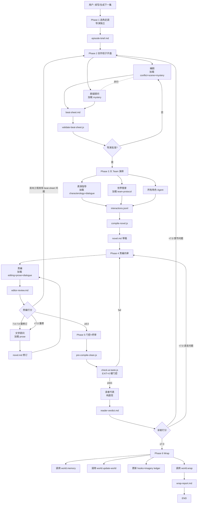

# Workflow · 6 阶段创作流水线（v3 · Team 模式升级）

> 基于"豪华八人班子"的剧集生成流水线。
> **v3 关键变化**（EP04+ 生效）：把 Phase 3 心脏戏 / Phase 4 责编 / Phase 5 读者终审升级为**真 Team 模式**（task(name, team_name) + send_message）· 替代 persona 切换。其他阶段保持 persona。
> 设计哲学：**Token 预算回归创作**——创作环节占比从 24% 提升到 67%，评审环节从 40% 降到 15%。v3 在此基础上把关键评审/演绎位替换为真独立 agent。

---

## v3 Team 模式使用矩阵

| Phase | 子步骤 | 执行者 | 模式 |
|---|---|---|---|
| Phase 1 | 选角定调 | 导演 | 主 agent persona |
| Phase 2 | 编剧写 beat-sheet | drama-writer | **Team**（新故事首集或读者 < 7 的修订集）/ persona（默认）|
| Phase 2 | 悬疑顾问写建议 | drama-advisor(mystery) | persona（或 Team · 极少数）|
| Phase 3 | 过渡场 / 沉淀场 | 主 agent | persona |
| Phase 3 | **心脏戏（F3 冲突 / F7 爆发）** | drama-character × N + drama-world-keeper | **Team 必须** |
| Phase 3.7 | 编译 novel.md | 主 agent | persona |
| Phase 4 | 责编 8 步 SOP | drama-editor | **Team 必须** |
| Phase 4 | 文学顾问按 order 修订 | drama-advisor(prose) | persona |
| Phase 5 | AI 味硬门控 | check-ai-taste.js | 确定性脚本 |
| Phase 5 | 读者盲评 | drama-reader | **Team 必须**（已验证·EP03 试跑）|
| Phase 6 | Wrap | drama-world scripts | 确定性脚本 |

### 反 persona 三条标准（何时必须 Team）

**命中 ≥2 条必须 Team 化**：

1. **身份独立性**：TA 的判断需要与作者视角分离吗？
2. **信息封闭性**：TA 应该看不到某些内部文档吗？
3. **对抗性**：TA 的作用是挑毛病吗？

---

## 流水线总览

```
Phase 1: 导演独立选角定调                         [persona]
Phase 2: 创作班子开盘（编剧 + 悬疑顾问）            [persona · 特殊情况 team]
Phase 3: 演绎
  ├── 过渡场 / 沉淀场                           [persona]
  └── 心脏戏                                   [TEAM]
Phase 4: 责编内审                              [TEAM]
         文学顾问润色                          [persona]
Phase 5: AI 味机械门控 + 读者代表终审             [TEAM]
Phase 6: Wrap 收尾                             [脚本]
```

### 与 v2 / 旧版对比

| 项 | 旧版 | 新版 | 变化 |
|---|---|---|---|
| Phase 数 | 10（含 1.5, 4.5-4.9） | 6 | -40% |
| 评审 Agent 数 | 9（4 读者+4 专家+1 Critic） | 2（责编+读者代表）+1 脚本 | -78% |
| Token/集（评审部分） | ~27K | ~7K | -74% |
| 创作 Agent 数 | 1-2（导演+可选 world-manager） | 6（编剧+悬疑顾问+表演指导+世界管家+角色+文学顾问） | +300% |
| 迭代上限 | Phase 4.5-4.9 各 2 轮 | Phase 4 最多 2 轮 | 简化 |
| 硬门控 | 2 处（check-ai-taste + 读者均分） | 2 处（check-ai-taste + 读者代表终审） | 等价 |

---

## 执行前检查

Director 加载时先检测断点：

```
1. 查找当前故事的 episodes/*/.fsm-state.json
2. 如有未完成 episode（state ≠ idle/wrapped）→ 询问用户是否继续
3. 继续 → 从断点 Phase 恢复
4. 不继续 → 正常响应新请求
```

断点恢复时必须重新加载：
- episode-brief.md（Phase 1 产出）
- beat-sheet.md（Phase 2 产出）
- 任何已有的 output/*.md

---

## Phase 1: 导演独立选角定调

| 属性 | 值 |
|---|---|
| **类型** | 确定性（导演独立完成，不 spawn 其他 Agent） |
| **FSM 状态** | idle → initializing → context-ready |
| **Token 预算** | ~3K |

### 目的

导演是**指挥位**——只做战略决策。Phase 1 是导演唯一独立执行的阶段。

### 步骤

**Step 1.1：读取上下文（确定性）**
- 读 `stories/<name>/world/state.json`（carry_over + world_state）
- 读 `stories/<name>/world/timeline.md`（故事时间线）
- 读前集 `wrap-report.md`（最近 1-2 集）
- 读 `stories/<name>/world/hooks-ledger.md`（钩子台账）
- 读 `stories/<name>/world/imagery-ledger.md`（意象台账）

**Step 1.2：调用 drama-world 的校验能力（确定性）**
```bash
node .codebuddy/skills/drama-world/scripts/validate.js --story <name>
```
如失败 → 阻断并报告缺失字段。

**Step 1.3：保底快照（确定性）**
```bash
node .codebuddy/skills/drama-world/scripts/snapshot.js create <ep-id> --story <name>
```
失败 warn 但不阻断（失去回滚能力但不影响生成）。

**Step 1.4：初始化 episode 目录（确定性）**
```bash
node .codebuddy/skills/drama-world/scripts/init.js <ep-id> --story <name>
```

**Step 1.5：导演选角（战略决策）**

导演基于上下文做三个决策：

```
决策 A：本集出场角色
  - S/A/B/C 混编（S 级必有 1-2 个，C 级可作为背景）
  - 依据：谁的创伤链会被触发？谁推进本集主线？

决策 B：本集基调（一句话）
  - 示例："压抑中的微光" / "破碎后的平静" / "冷静中的绝望"
  - 基调决定后续班子的语气导向

决策 C：本集在系列中的位置
  - 是推进集 / 沉淀集 / 爆发集 / 转折集？
  - 决定字数预算（爆发集 8000 字 / 沉淀集 6500 字等）
```

**Step 1.6：产出 episode-brief.md（确定性写入）**

写入 `stories/<name>/episodes/<ep-id>/episode-brief.md`：

```markdown
# Episode Brief · EP{XX}

## 集位置（v2 必填）
- position: 推进集 / 沉淀集 / 爆发集 / 揭示集 / 转折集 / 过渡集  # 必填
- 字数区间：{依 position 分级 · 见下表}

| position | 字数下限 | 字数上限（软） |
|---|---|---|
| 爆发集 / 揭示集 | 6500 | 8500 |
| 推进集 / 转折集 | 5500 | 7500 |
| 沉淀集 | 4000 | 6000 |
| 过渡集 | 3000 | 4500 |

## 导演基调
> {一句话}

## 出场角色
- S 级：林墨（主视角）、周文渊
- A 级：陈教授
- B 级：...
- C 级：保洁阿姨（背景）

## 本集任务（导演对班子的交代）
- 主线推进：...
- 创伤触发目标：林墨对"金属门"的创伤在本集被二次激活
- 钩子任务：回收 H03, 释放新 B 级钩子
- 叙事时间规划（v2 新增 · 至少一项）：
  - 闪回：...（可选）
  - summary 压缩：...（可选）
  - 慢镜拉伸：...（高潮场建议）

## 上下文摘要
- carry_over：...
- 前集结尾悬念：...
- 需特别注意的 canon 约束：...

## 导演签字
- 时间戳：
- 快照 ID：{snapshot-id}
```

### Checkpoint

- [ ] validate 通过
- [ ] 快照已创建
- [ ] episode 目录初始化
- [ ] episode-brief.md 已写入

### 失败策略

- validate 失败 → 阻断，提示用户修复 SOUL.yaml
- 快照失败 → warn，继续（但提醒用户失去回滚能力）
- 其余均为确定性步骤，失败即报错

---

## Phase 2: 创作班子开盘

| 属性 | 值 |
|---|---|
| **类型** | 灵活（Team 模式，并行 spawn） |
| **FSM 状态** | context-ready → planning |
| **Token 预算** | ~8K（编剧 5K + 悬疑顾问 3K） |

### 目的

由**编剧**和**悬疑顾问**协作写 beat-sheet v3。导演只做批准/打回。

### 班子成员

- **编剧**（Task Agent，load: conflict.md + scene-design.md + mystery.md）
- **悬疑顾问**（Task Agent，load: mystery.md）
- 导演（主 Agent 自己）

### 步骤

**Step 2.1：spawn 编剧 + 悬疑顾问（并行）**

编剧和悬疑顾问并行工作——编剧写骨架，悬疑顾问同步做三铁律检查。

```
导演 → spawn 编剧:
  输入：episode-brief.md + 角色 SOUL.yaml + hooks-ledger + imagery-ledger
  任务：写 beat-sheet v3（场景+动机+钩子+自检 8 问）
  产出：beat-sheet.draft.md

导演 → spawn 悬疑顾问（与编剧并行）:
  输入：episode-brief.md + hooks-ledger
  任务：预先规划本集三铁律满足方案
  产出：mystery-advisor-notes.md（内部文件，供编剧参考）
```

**Step 2.2：编剧汇总悬疑顾问意见**

编剧在 beat-sheet v3 中整合悬疑顾问的建议：

- 三铁律具体在哪些 Beat 实现
- A 级钩子用三明治结构引入
- 第三方物理反应的具体物品/声音

**Step 2.3：编剧内嵌 8 问自检**

编剧在 beat-sheet v3 顶部写入"writer_self_check"块（详见 `craft/conflict.md` 第九节）。

任何一条红线触发 → 编剧**自己重写** beat-sheet，最多 2 轮。

**Step 2.4：validate-beat-sheet 脚本校验（确定性门控）**

```bash
node .codebuddy/skills/drama-director/scripts/validate-beat-sheet.js \
     --story <name> --episode <ep-id>
```

校验项（v2 升级）：
- 字数门槛按 position 分级（爆发/揭示 ≥6500、推进/转折 ≥5500、沉淀 ≥4000、过渡 ≥3000）
- 8 问答案块存在
- 所有场景含三层动机
- 前集事实核对清单存在
- **scene_weight 覆盖率 ≥80%（软约束 · 警告不阻断）**
- **position 显式声明（软约束 · 警告不阻断）**

失败 → 编剧重写。软警告 → 责编在 Phase 4 时重点关注。

### Beat-Sheet yaml Schema（v3.1 · v2 升级）

每个 scene 必含 `scene_weight` 三项：

```yaml
scenes:
  - id: scene_3
    title: "..."
    budget_chars: 1900
    function: F7 爆发
    
    # ✨ v2 新增：叙事重量三项测试（详见 craft/narrative-weight.md）
    scene_weight:
      irreversible_action: "林墨第一次主动开口问完整问题（沉默防御被打破·不可撤销）"
      new_info_for_reader: "沈砚之承认'会听见'（A 级钩子 H-A3 深化）"
      state_change:
        from: "林墨-沈砚之是'监护人 vs 被监护人'"
        to:   "林墨-沈砚之是'两个都听得见的人'"
    
    # ... 原有字段（冲突、反相位、三层动机、钩子等）
```

**scene_weight 填写标准**：
- 三项都有 → 场景重量充分
- 两项有 → 合格（沉淀/过渡场可少一项）
- 一项 → 不合格 · 重写
- 零项 → 立即删除本场

**写入 episodes/<ep-id>/beat-sheet.md 顶部 yaml 元数据**中还需 position 字段：

```yaml
---
story: jiu-ge
episode: ep03-...
title: "..."
position: 沉淀集   # ✨ v2 必填 · 与 brief 一致
word_budget: 5000   # 依 position 区间
# ...
---
```

**Step 2.5：导演批准 / 打回（战略决策）**

导演读 beat-sheet v3，做**非详细**的审批：

- 基调是否与 episode-brief 一致
- 选角是否全部被合理使用
- 情绪弧线是否符合导演意图

批准 → 进入 Phase 3
打回 → 告诉编剧具体问题（最多 1 次打回，第 2 次强行通过）

**Step 2.6：产出 beat-sheet.md（确定性）**

写入 `stories/<name>/episodes/<ep-id>/beat-sheet.md`（从 draft 转正）。

### Checkpoint

- [ ] beat-sheet v3 通过 writer_self_check 8 问
- [ ] validate-beat-sheet 脚本通过
- [ ] 悬疑顾问意见已整合（悬疑类故事）
- [ ] 导演批准

### 失败策略

- 8 问红线触发 → 编剧重写（≤2 轮，第 3 轮标注"预检勉强通过"）
- validate 失败 → 编剧重写
- 导演打回 → 编剧修订（≤1 次）

---

## Phase 3: 大 Team 演绎

| 属性 | 值 |
|---|---|
| **类型** | 灵活（核心创作环节，大 Team 模式） |
| **FSM 状态** | planning → simulating |
| **Token 预算** | ~20K（占全集最大） |

### ✨ v3 执行规则（EP04+ 生效）

Phase 3 按**场景功能分级**选择执行模式：

| 场景功能 | 执行模式 | 班子成员 |
|---|---|---|
| F3 冲突（高点）| **Team** | drama-character × 2-3 + drama-world-keeper |
| F7 爆发 | **Team** | drama-character × 2-3 + drama-world-keeper |
| F4 披露（高潜台词）| **Team**（可选）| 同上 |
| F1 建立 / F2 设定 | persona | 主 agent |
| F5 沉淀 / F6 过渡 | persona | 主 agent |
| F8 收束 | persona | 主 agent |

**每集默认 1-2 场心脏戏走 Team**。过多会失控 · 过少失去 Team 价值。

**选场原则**：看 beat-sheet 的 scene_weight · `irreversible_action` 最重、new_info_for_reader 最硬的场 = 心脏戏。

---

### v3 Team 模式的核心优势

- **对话真实性**：角色 agent 根据 SOUL 自主决定 · 主 agent 无法"全知分饰多角"作弊
- **SOUL 扎根**：角色的每个选择必须可追溯到 want/need/fear
- **世界管家裁判**：合法性检查拦截"恰好问到点子上"的导演作弊
- **记录可复盘**：team-play-log.md 保留每一轮交互 · Phase 3.7 编译有原始素材

---

### 班子成员（v3）

- **drama-world-keeper**（Team · spawn · 加载 team-protocol.md）· 节奏/信息/事件裁判
- **drama-character × N**（Team · 每个出场角色独立 spawn · 只加载自己 SOUL + MEMORY）
- **drama-advisor(performance)**（Phase 3 前 · persona · 可选 · 写 performance-briefing.md 给世界管家）
- **导演（主 Agent）**· 战略监督 + 仲裁 + 最终编译

---

### 步骤（v3 心脏戏）

**Step 3.1：选心脏戏 · 准备场景条件**

```
根据 beat-sheet 的 scene_weight 选出 1-2 场心脏戏。
对每场心脏戏：
  - 读 beat-sheet 的 scene 元数据（迟入条件、三层动机、scene_weight）
  - 读出场角色的 SOUL.yaml + MEMORY.md
  - 起草"世界管家场景条件包"（时间/地点/光线/角色物理距离）
```

**Step 3.2：Team 建团**

```javascript
team_create({
  team_name: "ep<XX>-scene<N>",
  description: "EP<XX> 心脏戏 Team 演绎 · Scene <N>"
})
```

**Step 3.3：Spawn Team 成员**

按顺序 spawn（**世界管家先起** · 才能接收角色回复）：

```javascript
// 3.3.1 spawn 世界管家
task({
  subagent_name: "drama-world-keeper",
  name: "world-keeper",
  team_name: "ep<XX>-scene<N>",
  prompt: "你负责 Scene <N> 的节奏和信息裁判 · beat-sheet 路径 X · 场景条件包 Y · 开始注入场景"
})

// 3.3.2 对每个出场角色 spawn drama-character
task({
  subagent_name: "drama-character",
  name: "lin-mo",  // 角色 id
  team_name: "ep<XX>-scene<N>",
  prompt: "你的 SOUL：stories/<name>/agents/s_lin-mo/SOUL.yaml · MEMORY · 场景开场条件 · 等世界管家的消息"
})

task({
  subagent_name: "drama-character",
  name: "shen-yanzhi",
  team_name: "ep<XX>-scene<N>",
  prompt: "..."
})
```

**Step 3.4：触发演绎**

主 agent 给世界管家发消息 · 让它启动排队：

```javascript
send_message({
  type: "message",
  recipient: "world-keeper",
  content: "Scene <N> 可以开始 · 第一个发言角色由你决定 · 请按 beat-sheet 推进"
})
```

然后主 agent**进入等待状态** · 监听 team-lead inbox。

**Step 3.5：演绎循环（由世界管家主导）**

```
世界管家 → send_message 给角色 A：场景条件 + 听到看到的
角色 A → send_message 给世界管家：台词/动作/沉默
世界管家 → 裁判 + 记录 team-play-log.md + 选下一发言
世界管家 → send_message 给角色 B：...
...
```

主 agent 只在两种情况介入：
1. 世界管家请求仲裁（`send_message from world-keeper with type=request`）
2. 循环超过 ~20 轮无推进（主 agent 主动 shutdown 并回主线）

**Step 3.6：本场结束**

世界管家判定 beat 完成 → send_message 主 agent："Scene <N> 完成 · team-play-log.md 已写入"

**Step 3.7：Team 收尾**

```javascript
// 每个成员
send_message({ type: "shutdown_request", recipient: <member> })
// 等 shutdown_response
team_delete()
```

**Step 3.8：下一场 / 编译**

- 如果还有心脏戏 → 回 Step 3.2 建下一 team（每场 team 独立）
- 如果心脏戏全跑完 → 主 agent 进入编译

**Step 3.9：编译 novel.md 草稿（v3）**

```bash
node .codebuddy/skills/drama-director/scripts/compile-novel.js \
     --story <name> --episode <ep-id>
```

编译输入：
- 心脏戏：`runtime/team-play-log.md`（每场一份）
- 非心脏戏：主 agent persona 写的草稿段落

编译规则：
- 心脏戏部分**严格按 team-play-log.md 的台词/动作落地** · 不得改动
- 非心脏戏部分**主 agent 自由发挥** · 但要与 team 段落的文风一致

---

### 步骤（v2 · 非心脏戏 persona）

非心脏戏场（F1/F2/F5/F6/F8）继续 persona 执行 · 不走 team · 主 agent 直接按 beat-sheet 写入 novel.md。

### Checkpoint

- [ ] 所有 beat-sheet 场景都有对应的 interactions
- [ ] interactions.jsonl 已保存
- [ ] novel.md 草稿已编译

### 失败策略

- 场景陷入重复 → 世界管家注入事件
- Agent 使用超出 known_facts 的信息 → 世界管家立即纠正
- 角色违反 SOUL 设定 → 表演指导介入
- 严重偏离 beat-sheet → 编剧通知导演，导演决定是否回 Phase 2

---

## Phase 4: 责编内审 + 文学顾问润色

| 属性 | 值 |
|---|---|
| **类型** | ✨ **v3 Team 必须**（责编）+ 按需迭代（修订 ≤ 2 轮） |
| **FSM 状态** | simulating → reviewing |
| **Token 预算** | ~5K（责编 Team 5K + 可选文学顾问 3K） |

### 目的

**责编一人吸收原 9 人评审的职责**：打分 + 诊断 + 修订指令 + 多元视角。

### ✨ v3 执行规则

Phase 4 的**责编必须 Team 化**（反 persona 三条标准全部命中 3/3）。

- **责编** → spawn `drama-editor` subagent（独立上下文 · 不加载 beat-sheet 的作者意图字段 · 不读 reader-verdict）
- **文学顾问** → 主 agent persona 扮演（`drama-advisor(prose)` 仅特殊情况 spawn）
- **导演（主 Agent）** → 战略监督 + 仲裁

### 步骤（v3）

**Step 4.1：Spawn 独立责编**

```javascript
team_create({ team_name: "ep<XX>-review" })

task({
  subagent_name: "drama-editor",
  name: "editor",
  team_name: "ep<XX>-review",
  prompt: "审 stories/<name>/episodes/<ep-id>/output/novel.md · 执行 8 步 SOP · 写入 editor-review.md · 完成后 send_message 给 main 报告分数和修订清单摘要"
})
```

**Step 4.2：等责编完成**

主 agent 监听 team-lead inbox 等责编 send_message：

```yaml
# editor → main 消息格式
final_score: 8.2
verdict: PASS | NEED_REVISION | NEED_REVISION_HEAVY | REGRESS_TO_PHASE_2
revision_orders:
  - { target: ..., priority: high, executor: 文学顾问/编剧/责编自执行 }
  - ...
step_5_5_diagnosis_summary: "..."
four_taboos_check: "all clear | 触发了禁令 X"
```

**Step 4.3：责编执行 8 步 SOP 的内部流程**（由 drama-editor 自主执行 · 主 agent 不介入）

```
Step 4.1.1: 通读 novel.md
Step 4.1.2: 给直觉分数
Step 4.1.3: 5 视角复查
Step 4.1.4: 找共识问题
Step 4.1.5: 根因诊断
Step 4.1.5.5: ✨ 诊断前置（诊断树走查 · 参见 narrative-weight.md）
Step 4.1.6: 写修订指令清单（严格遵守"反流水账四禁"）
Step 4.1.8: 裁决
```

**责编加载**：`editing.md` + `prose.md` + `dialogue.md` + **`narrative-weight.md`**

**v2 关键约束（由 drama-editor 内部强制）**：
- ⛔ 禁止"补到 XXXX 字"类 order
- ⛔ 文学顾问不得接陈设补白单
- ⛔ 字数不足优先删场/改 position · 不优先补场
- ⛔ position 声明必须先于字数判断

**Step 4.4：裁决分支（由主 agent 基于责编报告判断）**

```yaml
if editor_score >= 8.0:
  verdict: PASS
  next: shutdown editor → team_delete → Phase 5

elif editor_score >= 7.0:
  verdict: NEED_REVISION
  next: Step 4.5 → 可能需要 1 轮修订

else (editor_score < 7.0):
  verdict: NEED_REVISION_HEAVY
  next: Step 4.5 → 必须至少 1 轮修订

if need_beatsheet_redo:
  verdict: REGRESS_TO_PHASE_2
  next: shutdown editor → 回 Phase 2 · 考虑 spawn drama-writer 重写 beat-sheet
```

**Step 4.5：执行修订（persona 执行 · 非 Team）**

按责编的 revision_orders 分类执行：

```yaml
executor: 责编自执行
  → drama-editor 自己小改（≤3 行 · 已有 Write 权限）

executor: 文学顾问
  → 主 agent persona 扮演文学顾问 · 按 narrative-weight.md 第八节禁令自检
  → 或特殊情况 spawn drama-advisor(prose)

executor: 编剧
  → 回 Phase 2 · 考虑 spawn drama-writer 重写本场 beat
```

**Step 4.6：责编复审（第二轮 · 可选）**

修订完成后 · 如果 verdict 是 NEED_REVISION_HEAVY：

```javascript
// 复用同一 team（责编已有上下文）
send_message({
  type: "message",
  recipient: "editor",
  content: "修订已完成 · 请复审 novel.md · 给出新的裁决分数"
})
```

最多 2 轮。2 轮后仍不通过 → 主 agent 强裁（写入 wrap-report）。

**Step 4.7：Team 收尾**

```javascript
send_message({ type: "shutdown_request", recipient: "editor" })
// 等 shutdown_response
team_delete()
```

文学顾问完成改写后，责编复查：

- 改动是否符合指令
- 是否引入新问题

通过 → 进入 Step 4.6
不通过 → 发回文学顾问再改（最多 1 次）

**Step 4.6：迭代计数**

```yaml
if revision_rounds >= 2:
  force_pass: true
  note: "已达 2 轮上限，进入 Phase 5，editor-review 标注'勉强通过'"

else:
  if editor_score_after_revision < 7.0:
    go to Step 4.1 再来一轮 (revision_rounds++)
  else:
    verdict: PASS
    go to Phase 5
```

**最多 2 轮修订**。第 3 轮强行通过。

### Checkpoint

- [ ] editor-review.md 已产出
- [ ] 责编最终打分 ≥ 7.0（或已达 2 轮上限）
- [ ] 若有修订，修订 diff 已记录
- [ ] 未引入新的 A 级违规

### 失败策略

- 责编 Agent 输出格式不合规 → 导演介入重新激活
- 文学顾问越权（改了情节）→ 责编退回指令
- 责编发现根因在 beat-sheet → 导演决定是否回 Phase 2

---

## Phase 5: AI 味机械门控 + 读者代表终审

| 属性 | 值 |
|---|---|
| **类型** | 混合（机械门控 + 直觉终审） |
| **FSM 状态** | reviewing → validating |
| **Token 预算** | ~2K（读者代表） |

### 目的

两道关卡：
1. **机械门控**：脚本自动检测 A 级硬约束（破折号/加粗/EPxx 等）
2. **读者终审**：1 个读者代表做"会不会追下一集"的直觉判断

### 步骤

**Step 5.1：编译前清理（确定性）**

```bash
node .codebuddy/skills/drama-director/scripts/pre-compile-clean.js \
     --story <name> --episode <ep-id>
```

批量消除破折号/加粗/标题。

**Step 5.2：AI 味硬门控（确定性）**

```bash
node .codebuddy/skills/drama-critic/scripts/check-ai-taste.js \
     --story <name> --episode <ep-id>
```

- EXIT=0 → 通过，进入 Step 5.3
- EXIT=1 → 阻断。详细问题清单给责编，进入 Phase 4 的第 2 轮修订（如果还没用满）
- 若已达 2 轮上限，Warn 继续（wrap-report 标注遗留问题）

**Step 5.3：Spawn 独立读者（v3 Team 必须）**

```javascript
team_create({ team_name: "ep<XX>-reader" })

task({
  subagent_name: "drama-reader",
  name: "reader",
  team_name: "ep<XX>-reader",
  prompt: "你是连载读者 · 只读 stories/<name>/episodes/<ep-id>/output/novel.md · 若 stories/<name>/runtime/reader-memory.md 存在请先读 · 给出 7 项读者反馈 · send_message 给 main · 可选：更新 reader-memory.md"
})
```

**关键约束**（drama-reader 内部强制）：
- ❌ 禁读 craft / beat-sheet / editor-review / brief / wrap-report / mystery-advisor-notes
- ✅ 只读 novel.md + 可选前 1-2 集 novel.md + 可选 reader-memory.md

**v3 对比 v2 的关键变化**：
- v2：主 agent persona 扮演读者（已验证**分数偏高 20%**）
- v3：drama-reader subagent 独立 spawn · 严格身份封闭
- v3 试跑结果（EP03）：persona 9.0 → team 7.5 · 差距显著

**Step 5.3.5：读者回传**

主 agent 监听 inbox · 接收读者的 7 项回答：
1. 一句话感受
2. 会不会追下一集
3. 评分（1-10）
4. 最好一段（引用原文）
5. 最不爽一段（引用原文）
6. 困惑清单（3-7 条）
7. 对作者的话

主 agent 负责把 7 项答案落盘到 `stories/<name>/episodes/<ep-id>/output/reader-verdict.md`。

**Step 5.3.6：更新 reader-memory.md（v3 跨集记忆）**

读者回传后 · 主 agent 视情况请 drama-reader 更新 `stories/<name>/runtime/reader-memory.md`：
- 本集分数加入评分曲线
- 本集困惑加入"积累的困惑"
- 本集对作者的话加入"累积意见"

这份 memory 会在下一集 Phase 5 被新 spawn 的 drama-reader 读到 · 保证"连载感"。

**Step 5.4：读者终审裁决**

```yaml
if reader_score >= 7.0:
  verdict: PASS
  next: shutdown reader → team_delete → Phase 6

if reader_score < 7.0:
  if 读者给出的理由是"情节问题" → 回 Phase 2（考虑 spawn drama-writer 重做 beat-sheet）
  if 读者给出的理由是"语言/节奏问题" → 回 Phase 4（重 spawn drama-editor 再审）
  
  迭代上限：
    - Phase 4-5 循环最多 2 轮
    - 第 3 轮强行通过，wrap-report 标注

# 特殊情况：reader_score 显著低于 editor_score（差距 ≥ 1.5 分）
if editor_score - reader_score >= 1.5:
  warning: "责编可能也被作者视角污染 · 下一集责编复用前 · 考虑改派新 drama-editor 实例"
```

**Step 5.5：Team 收尾**

```javascript
send_message({ type: "shutdown_request", recipient: "reader" })
// 等 shutdown_response
team_delete()
```

### Checkpoint

- [ ] pre-compile-clean 已跑
- [ ] check-ai-taste EXIT=0（或已标注遗留问题）
- [ ] reader-verdict.md 已产出
- [ ] 读者代表打分 ≥ 7.0（或已达上限）

### 失败策略

- AI 味门控失败 → 回 Phase 4 修订
- 读者终审失败 → 按理由分流回 Phase 2 或 Phase 4

---

## Phase 6: Wrap 收尾

| 属性 | 值 |
|---|---|
| **类型** | 确定性（机械执行） |
| **FSM 状态** | validating → wrapping → wrapped → idle |
| **Token 预算** | ~3K |

### 目的

调用 drama-world 的能力完成状态更新，产出 wrap-report。

### 步骤

**Step 6.1：MEMORY 写入（调用 world 能力）**

```bash
node .codebuddy/skills/drama-world/scripts/memory.js \
     --story <name> --episode <ep-id> --action write
```

按 tier 上限写入（S:2000 / A:1200 / B:600 字符）。超容量时自动归档旧条目。

**Step 6.2：世界状态更新（调用 world 能力）**

```bash
node .codebuddy/skills/drama-world/scripts/update-world.js \
     --story <name> --episode <ep-id>
```

更新 `world/state.json` + `world/timeline.md`。

**Step 6.3：钩子/意象台账更新（责编+文学顾问协助）**

责编更新 `world/hooks-ledger.md`（本集释放/强化/回收的钩子）。
文学顾问更新 `world/imagery-ledger.md`（本集激活的意象阶段）。

这两个 ledger **由 Agent 手工维护，不再用脚本自动化**。

**Step 6.4：Session 收尾（调用 world 能力）**

```bash
node .codebuddy/skills/drama-world/scripts/wrap.js \
     --story <name> --episode <ep-id>
```

产出 `wrap-report.md` + 更新元数据。

**Step 6.5：FSM 归位**

```
FSM transition → wrapped → idle
持久化最终状态
```

### wrap-report.md 内容

```markdown
# Wrap Report · EP{XX}

## 产出清单
- brief: ✓
- beat-sheet: ✓
- novel: ✓ (字数: XXXX)
- editor-review: ✓ (分数: X.X)
- reader-verdict: ✓ (分数: X.X)

## 本集修订轮次
- 编剧 8 问预检：1 轮通过
- 责编内审：1 轮通过（或 2 轮，标注）
- Phase 4-5 循环：0 轮（或 1/2 轮）

## 本集钩子变更
- 释放：H15, H16
- 强化：H07
- 回收：H03

## 本集意象变更
- 手表：阶段 2 → 阶段 2（本集深化）
- 茉莉花茶：新引入（阶段 1）

## 状态变更
- 角色关系：林墨-周伯 信任度 6→2
- World state：林墨已离开北京（记入 timeline）

## 遗留问题（若有）
- AI 味门控在第 2 轮修订后仍有 1 个 warning（C5.3 明喻堆叠）
- wrap-report 标注此问题，下集注意

## 签字
- 导演：✓
- 责编：✓
- 时间戳：...
```

### Checkpoint

- [ ] MEMORY 各角色未超容量
- [ ] state.json + timeline.md 已更新
- [ ] hooks-ledger + imagery-ledger 已更新
- [ ] wrap-report.md 已产出
- [ ] FSM 归位

---

## 每集必需件（新六件套）

`stories/<name>/episodes/<ep-id>/` 下必须存在：

| 文件 | 作用 | 产出阶段 |
|---|---|---|
| `episode-brief.md` | 导演选角定调 | Phase 1 |
| `beat-sheet.md` | 编剧骨架+8 问自检 | Phase 2 |
| `output/novel.md` | 正文 | Phase 3-5（迭代） |
| `output/editor-review.md` | 责编内审报告 | Phase 4 |
| `output/reader-verdict.md` | 读者代表终审 | Phase 5 |
| `wrap-report.md` | 集收尾总结 | Phase 6 |

可选产出：
- `runtime/interactions.jsonl`（Phase 3 中间产物）
- `runtime/revision-log.md`（Phase 4 修订记录，多轮时用）
- `runtime/mystery-advisor-notes.md`（Phase 2 悬疑顾问意见）

---

## 能力引用映射（drama-world）

Director/班子通过"能力名"引用 drama-world 的脚本：

| 能力名 | 对应脚本 | 用途 |
|---|---|---|
| World.校验能力 | validate.js | Pre-flight 检查角色完整性 |
| World.快照能力 | snapshot.js | 保底备份 + 回滚 |
| World.上下文构建 | build-context.js | 组装世界/角色上下文 |
| World.场景构建 | build-scene.js | 构建单场景上下文 |
| World.记忆写入 | memory.js | 有界记忆管理 |
| World.世界更新 | update-world.js | state + timeline 更新 |
| World.收尾能力 | wrap.js | Session 收尾 + 报告 |
| World.状态查询 | status.js | 三层状态检查 |
| World.episode初始化 | init.js | 创建 episode 目录 + FSM |

详细脚本路径见 `drama-world/SKILL.md` 的 Domain B 表格。

---

## Harness 设计原则

**确定性节点**（脚本驱动）：
- validate / snapshot / init / build-scene / memory / update-world / wrap
- pre-compile-clean / check-ai-taste / validate-beat-sheet
- 脚本 exit code 提供可靠反馈

**灵活节点**（LLM 自主）：
- Phase 1 选角定调
- Phase 2 编剧创作 + 悬疑顾问咨询
- Phase 3 演绎
- Phase 4 责编内审 + 文学顾问润色

**FSM 状态追踪**：
- 记录当前 Phase + Sub-step
- 断点恢复的数据源
- 不强制约束，忘了调也不会阻断

**唯一硬门控**：
- `check-ai-taste.js` 的 exit code（LLM 可直接观察到 exit:0/1）
- 读者代表终审 ≥ 7.0

---

## 附录 A：完整流水线 Mermaid



---

## 附录 B：Token 预算详细分配

```
Phase 1 (导演独立):              ~3K
  - 读 state/timeline/wrap:      1K
  - validate/snapshot 反馈:       0.5K
  - 选角思考 + brief 产出:         1.5K

Phase 2 (编剧+悬疑顾问):          ~8K
  - 编剧 Agent context:          5K (load 3 个 craft 文件 + brief)
  - 悬疑顾问 Agent context:       3K (load mystery.md + 历史 hooks)

Phase 3 (大 Team 演绎):          ~20K
  - 表演指导:                     3K
  - 世界管家:                     2K
  - 每个角色 Agent × N:           8-15K (取决于角色数)
  - 编译 novel 草稿:               2K

Phase 4 (责编 + 文学顾问):        ~5K
  - 责编 Agent:                   5K (load 3 个 craft 文件)
  - 文学顾问 Agent (按需):         3K (load prose.md)

Phase 5 (门控 + 读者):           ~2K
  - 脚本门控反馈:                 0.5K
  - 读者代表 Agent:               2K (纯直觉，无 craft 加载)

Phase 6 (wrap):                  ~3K
  - 脚本反馈 + ledger 更新:        3K

合计: ~41K / 集
旧架构: ~62K / 集
节省: ~21K (34%)
创作占比: 从 24% → 67%
```

---

> 流水线的设计哲学：**让每一 token 都服务于"让故事更好"**。
> 评审是必要的，但评审不应该多于创作。
> 好的流水线是"80% 的预算给创造、20% 的预算给检查"——这次重构就是要回归这个比例。
